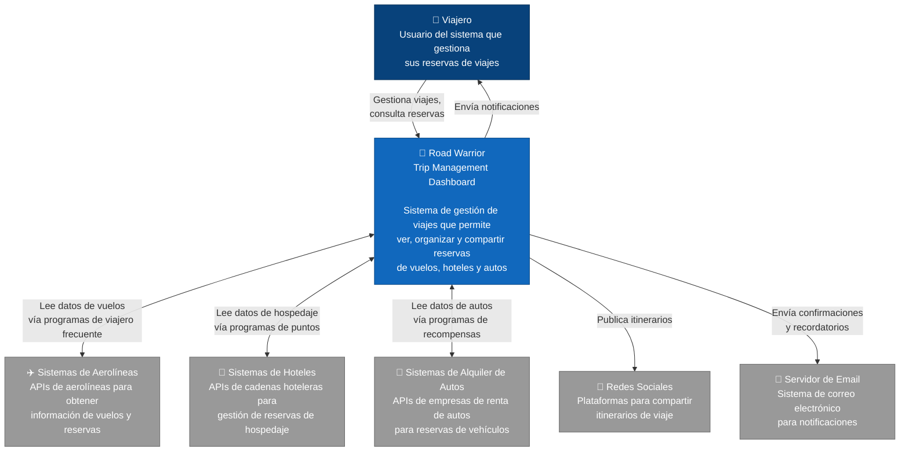

# C4 Nivel 1: Diagrama de Contexto

[⬅️ Volver al índice](./index-c4.md)

---

## 📖 Descripción

El **Diagrama de Contexto** muestra una vista de alto nivel del sistema Road Warrior Trip Management Dashboard y cómo interactúa con usuarios y sistemas externos. Este nivel proporciona una visión general del ecosistema completo.

### Alcance

- **Sistema en foco:** Road Warrior Trip Management Dashboard
- **Usuarios principales:** Viajeros que gestionan sus reservas
- **Sistemas externos:** Proveedores de servicios de viaje y redes sociales

---

## 🗺️ Diagrama de Contexto



---

## 🔍 Elementos del Diagrama

### Personas

| Elemento | Descripción | Responsabilidades |
|----------|-------------|-------------------|
| **Viajero** | Usuario final del sistema que planifica y realiza viajes | - Consultar reservas de vuelos, hoteles y autos<br/>- Agregar reservas manualmente<br/>- Organizar reservas por viaje<br/>- Compartir itinerarios |

### Sistemas

| Elemento | Descripción | Rol |
|----------|-------------|-----|
| **Road Warrior Trip Management Dashboard** | Sistema central de gestión de viajes | - Agregar y organizar todas las reservas<br/>- Integrarse con proveedores externos<br/>- Proporcionar interfaz web y móvil<br/>- Gestionar viajes y su ciclo de vida |
| **Sistemas de Aerolíneas** | APIs de aerolíneas comerciales | - Proveer información de vuelos<br/>- Sincronizar datos de programas de viajero frecuente |
| **Sistemas de Hoteles** | APIs de cadenas hoteleras y plataformas de reservas | - Proveer información de reservas de hospedaje<br/>- Sincronizar datos de programas de puntos |
| **Sistemas de Alquiler de Autos** | APIs de empresas de renta de vehículos | - Proveer información de reservas de autos<br/>- Sincronizar datos de programas de recompensas |
| **Redes Sociales** | Plataformas como Facebook, Twitter, Instagram | - Permitir compartir itinerarios de viaje<br/>- Publicar actualizaciones de viajes |
| **Servidor de Email** | Sistema de correo electrónico (SMTP) | - Enviar confirmaciones de cambios<br/>- Enviar recordatorios de viajes |

---

## 🔄 Flujos Principales

### 1. Sincronización Automática de Reservas
```
Sistemas Externos → Road Warrior → Viajero
```
El sistema obtiene automáticamente las reservas desde los sistemas de aerolíneas, hoteles y autos usando las credenciales de programas de viajero frecuente, puntos y recompensas del usuario.

### 2. Ingreso Manual de Reservas
```
Viajero → Road Warrior
```
El usuario puede agregar manualmente reservas que no fueron detectadas automáticamente.

### 3. Compartir Itinerario
```
Viajero → Road Warrior → Redes Sociales
```
El usuario puede compartir su itinerario de viaje en sus redes sociales.

### 4. Notificaciones
```
Road Warrior → Email → Viajero
```
El sistema envía notificaciones sobre cambios en reservas, recordatorios de viajes próximos, etc.

---

## 📊 Requisitos de Integración

### Interoperabilidad
- Integración con múltiples proveedores de servicios de viaje con diferentes tecnologías y protocolos
- APIs RESTful y/o SOAP según el proveedor
- Formatos de datos heterogéneos (JSON, XML)

### Seguridad
- Manejo seguro de credenciales de programas de viajero
- Encriptación de datos en tránsito (TLS/SSL)
- Autenticación OAuth 2.0 con proveedores externos

### Disponibilidad
- Alta disponibilidad (24/7) para usuarios globales
- Tolerancia a fallos en sistemas externos
- Caché de datos para disponibilidad offline

---

## ➡️ Siguiente Nivel

Para ver la arquitectura interna del sistema Road Warrior, consulte:

- [**Nivel 2: Diagrama de Contenedores**](./c4-L2-contenedores.md)

---

[⬅️ Volver al índice](./index-c4.md)
