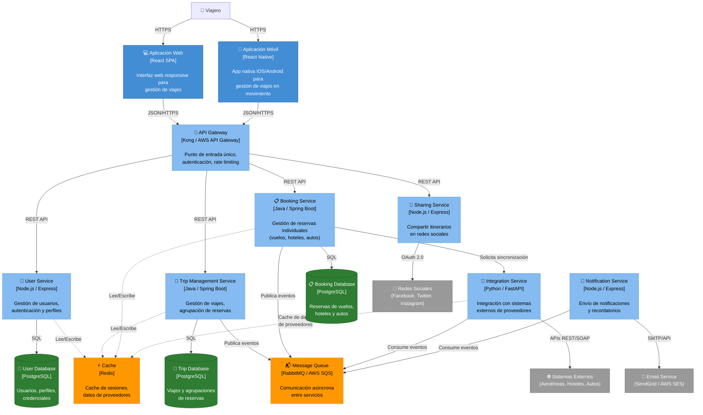

# C4 Nivel 2: Diagrama de Contenedores

[⬅️ Volver al índice](./index-c4.md) | [⬆️ Nivel anterior: Contexto](./c4-L1-contexto.md)

---

## 📖 Descripción

El **Diagrama de Contenedores** descompone el sistema Road Warrior en sus contenedores principales: aplicaciones cliente, servicios backend, bases de datos y sistemas de integración. Cada contenedor es una unidad desplegable independiente.

### Alcance

- **Sistema:** Road Warrior Trip Management Dashboard
- **Enfoque:** Arquitectura de contenedores y tecnologías principales
- **Nivel de detalle:** Contenedores desplegables y sus interacciones

---

## 🗺️ Diagrama de Contenedores



---

## 🔍 Elementos del Diagrama

### Aplicaciones Cliente

| Contenedor | Tecnología | Descripción | Responsabilidades |
|------------|------------|-------------|-------------------|
| **Aplicación Web** | React SPA | Single Page Application responsive | - Interfaz de usuario web<br/>- Gestión de viajes y reservas<br/>- Visualización de itinerarios |
| **Aplicación Móvil** | React Native | Aplicación nativa multiplataforma | - Interfaz móvil iOS/Android<br/>- Notificaciones push<br/>- Acceso offline |

### Capa de API

| Contenedor | Tecnología | Descripción | Responsabilidades |
|------------|------------|-------------|-------------------|
| **API Gateway** | Kong / AWS API Gateway | Puerta de entrada a los servicios | - Enrutamiento de requests<br/>- Autenticación JWT<br/>- Rate limiting<br/>- SSL/TLS termination |

### Servicios Backend (Microservicios)

| Contenedor | Tecnología | Descripción | Responsabilidades |
|------------|------------|-------------|-------------------|
| **Trip Management Service** | Java / Spring Boot | Gestión de viajes | - Crear y organizar viajes<br/>- Agrupar reservas por viaje<br/>- Eliminar viajes completados<br/>[Ver componentes →](./c4-L3-02-trip-management.md) |
| **Integration Service** | Python / FastAPI | Integración con proveedores | - Conectores para aerolíneas<br/>- Conectores para hoteles<br/>- Conectores para alquiler de autos<br/>- Mapeo de datos heterogéneos<br/>[Ver componentes →](./c4-L3-01-integration-service.md) |

### Almacenamiento de Datos

| Contenedor | Tecnología | Descripción | Datos Almacenados |
|------------|------------|-------------|-------------------|
| **User Database** | PostgreSQL | Base de datos de usuarios | - Usuarios y credenciales<br/>- Perfiles de viajero<br/>- Programas de fidelización |
| **Trip Database** | PostgreSQL | Base de datos de viajes | - Viajes y su estado<br/>- Agrupaciones de reservas<br/>- Fechas de inicio/fin |
| **Booking Database** | PostgreSQL | Base de datos de reservas | - Reservas de vuelos<br/>- Reservas de hoteles<br/>- Reservas de autos |

### Infraestructura

| Contenedor | Tecnología | Descripción | Uso |
|------------|------------|-------------|-----|
| **Cache** | Redis | Cache en memoria | - Sesiones de usuario<br/>- Datos de proveedores<br/>- Respuestas de APIs externas |
| **Message Queue** | RabbitMQ / AWS SQS | Cola de mensajes | - Eventos de dominio<br/>- Integración asíncrona<br/>- Procesamiento en segundo plano |

---

## 🔄 Flujos de Datos Principales

### 1. Login y Autenticación
```
Usuario → Web/Mobile App → API Gateway → User Service → User DB
                                                ↓
                                              Cache (JWT Token)
```

### 2. Sincronización de Reservas
```
Scheduler → Integration Service → Sistemas Externos (Aerolíneas/Hoteles/Autos)
                ↓
         Message Queue → Booking Service → Booking DB
                                ↓
                         Message Queue → Trip Service → Trip DB
```

### 3. Consulta de Viajes
```
Usuario → Web/Mobile App → API Gateway → Trip Service → Trip DB
                                              ↓
                                         (Check Cache)
                                              ↓
                                      Booking Service → Booking DB
```

### 4. Compartir Itinerario
```
Usuario → Web/Mobile App → API Gateway → Sharing Service → Redes Sociales
                                              ↓
                                         Trip Service → Trip DB
```

### 5. Ingreso Manual de Reserva
```
Usuario → Web/Mobile App → API Gateway → Booking Service → Booking DB
                                              ↓
                                       Message Queue → Trip Service
                                                           ↓
                                                  Auto-asignar a viaje
```

---

## 🏗️ Decisiones Arquitectónicas

### Arquitectura de Microservicios

**Decisión:** Adoptar una arquitectura de microservicios para los servicios backend.

**Razones:**
- **Escalabilidad independiente:** Cada servicio puede escalar según su demanda (ej: Integration Service durante sincronizaciones masivas)
- **Mantenibilidad:** Equipos independientes pueden trabajar en diferentes servicios
- **Tecnología heterogénea:** Permite usar el stack tecnológico más apropiado para cada servicio
- **Resiliencia:** Fallo de un servicio no compromete todo el sistema

### API Gateway

**Decisión:** Implementar un API Gateway como punto de entrada único.

**Razones:**
- **Seguridad centralizada:** Autenticación y autorización en un solo punto
- **Simplicidad para clientes:** Los clientes no necesitan conocer múltiples endpoints
- **Rate limiting:** Protección contra abuso de APIs
- **Monitoreo centralizado:** Observabilidad de todas las peticiones

### Event-Driven con Message Queue

**Decisión:** Usar comunicación asíncrona basada en eventos para integración entre servicios.

**Razones:**
- **Desacoplamiento:** Servicios no necesitan conocerse directamente
- **Resiliencia:** Si un servicio está caído, los mensajes se procesan cuando esté disponible
- **Escalabilidad:** Procesamiento asíncrono de operaciones pesadas
- **Eventual consistency:** Apropiado para el dominio (las reservas no cambian en tiempo real)

### Cache con Redis

**Decisión:** Implementar una capa de cache compartida.

**Razones:**
- **Performance:** Reducir latencia en consultas frecuentes
- **Reducción de carga en bases de datos:** Menos queries a PostgreSQL
- **Cache de datos externos:** Evitar llamadas repetidas a APIs de proveedores
- **Sesiones distribuidas:** Compartir sesiones entre instancias de servicios

### Bases de Datos Separadas por Servicio

**Decisión:** Cada microservicio tiene su propia base de datos.

**Razones:**
- **Independencia de datos:** Cada servicio es dueño de sus datos
- **Escalabilidad independiente:** Cada DB puede optimizarse según su servicio
- **Cambios sin impacto:** Cambios en esquema no afectan otros servicios
- **Mejor alineación con DDD:** Bounded contexts claros

---

## 📊 Atributos de Calidad

### Interoperabilidad
- **Integration Service** centraliza la complejidad de integración con múltiples proveedores
- Adaptadores específicos por proveedor
- Mapeo de datos heterogéneos a modelo unificado

### Disponibilidad
- **API Gateway** con balanceo de carga
- Servicios stateless que pueden replicarse horizontalmente
- **Cache** reduce dependencia de sistemas externos
- **Message Queue** permite procesamiento asíncrono sin bloqueos

### Seguridad
- **API Gateway** maneja autenticación JWT
- **User Service** centraliza gestión de credenciales
- Comunicación interna entre servicios en red privada
- Credenciales de proveedores encriptadas en **User DB**

### Escalabilidad
- Microservicios pueden escalar independientemente
- **Cache** reduce carga en bases de datos
- **Message Queue** permite procesamiento asíncrono de picos de carga
- Bases de datos pueden particionarse por servicio

---

## ➡️ Siguiente Nivel

Para ver los componentes internos de cada servicio, consulte:

### Componentes de Servicios Backend

- [**Integration Service - Componentes**](./c4-L3-01-integration-service.md)
- [**Trip Management Service - Componentes**](./c4-L3-02-trip-management.md)

---

[⬅️ Volver al índice](./index-c4.md) | [⬆️ Nivel anterior: Contexto](./c4-L1-contexto.md)
