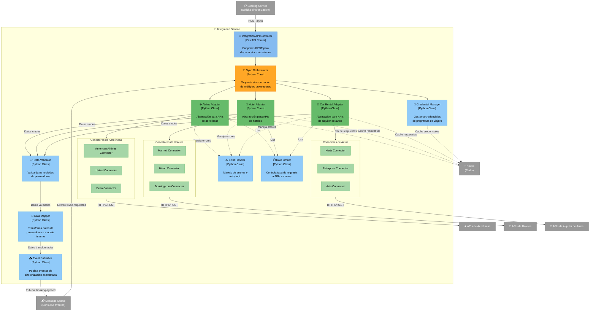

# C4 Nivel 3: Componentes - Integration Service

[⬅️ Volver al índice](./index-c4.md) | [⬆️ Nivel anterior: Contenedores](./c4-L2-contenedores.md)

---

## 📖 Descripción

El **Integration Service** es responsable de integrar el sistema Road Warrior con proveedores externos (aerolíneas, hoteles y empresas de alquiler de autos). Este servicio abstrae la complejidad de múltiples APIs heterogéneas y proporciona una interfaz unificada para el resto del sistema.

### Alcance

- **Contenedor:** Integration Service
- **Tecnología:** Python / FastAPI
- **Responsabilidad:** Integración con sistemas externos de proveedores de servicios de viaje

---

## 🗺️ Diagrama de Componentes



---

## 🔍 Componentes Detallados

### Capa de API

| Componente | Responsabilidad | Tecnología |
|------------|-----------------|------------|
| **Integration API Controller** | - Expone endpoints REST para sincronización manual<br/>- Valida requests entrantes<br/>- Delega a Sync Orchestrator | FastAPI Router |

### Capa de Orquestación

| Componente | Responsabilidad | Tecnología |
|------------|-----------------|------------|
| **Sync Orchestrator** | - Coordina sincronización de múltiples proveedores<br/>- Gestiona paralelización de requests<br/>- Maneja timeout y circuit breaker<br/>- Consolida resultados | Python Class (asyncio) |

### Adapters por Tipo de Proveedor

| Componente | Responsabilidad | Tecnología |
|------------|-----------------|------------|
| **Airline Adapter** | - Interfaz unificada para aerolíneas<br/>- Abstrae diferencias entre APIs<br/>- Delega a conectores específicos | Python Abstract Class |
| **Hotel Adapter** | - Interfaz unificada para hoteles<br/>- Abstrae diferencias entre APIs<br/>- Delega a conectores específicos | Python Abstract Class |
| **Car Rental Adapter** | - Interfaz unificada para alquiler de autos<br/>- Abstrae diferencias entre APIs<br/>- Delega a conectores específicos | Python Abstract Class |

### Conectores Específicos por Proveedor

#### Conectores de Aerolíneas

| Componente | Proveedor | Protocolo | Características |
|------------|-----------|-----------|-----------------|
| **American Airlines Connector** | American Airlines | REST/JSON | - OAuth 2.0<br/>- API propietaria |
| **United Connector** | United Airlines | REST/JSON | - API key authentication<br/>- Programa MileagePlus |
| **Delta Connector** | Delta Airlines | REST/JSON | - OAuth 2.0<br/>- Programa SkyMiles |

#### Conectores de Hoteles

| Componente | Proveedor | Protocolo | Características |
|------------|-----------|-----------|-----------------|
| **Marriott Connector** | Marriott Hotels | REST/JSON | - OAuth 2.0<br/>- Programa Bonvoy |
| **Hilton Connector** | Hilton Hotels | REST/JSON | - API key<br/>- Programa Honors |
| **Booking.com Connector** | Booking.com | REST/XML | - Affiliate API<br/>- XML responses |

#### Conectores de Alquiler de Autos

| Componente | Proveedor | Protocolo | Características |
|------------|-----------|-----------|-----------------|
| **Hertz Connector** | Hertz | SOAP/XML | - SOAP 1.2<br/>- Programa Gold Plus |
| **Enterprise Connector** | Enterprise | REST/JSON | - API key<br/>- Plus Rewards |
| **Avis Connector** | Avis | REST/JSON | - OAuth 2.0<br/>- Preferred Program |

### Componentes Transversales

| Componente | Responsabilidad | Tecnología |
|------------|-----------------|------------|
| **Data Mapper** | - Transforma datos de formato proveedor a modelo interno<br/>- Normaliza fechas, monedas, zonas horarias<br/>- Enriquece datos faltantes | Python Class (Pydantic models) |
| **Data Validator** | - Valida estructura de respuestas<br/>- Verifica campos obligatorios<br/>- Detecta datos inconsistentes | Python Class (Pydantic) |
| **Error Handler** | - Maneja errores de conectores<br/>- Implementa retry con exponential backoff<br/>- Circuit breaker por proveedor<br/>- Logging de errores | Python Class (tenacity lib) |
| **Credential Manager** | - Obtiene credenciales de programas de viajero<br/>- Encripta/desencripta tokens de acceso<br/>- Renueva tokens expirados | Python Class (cryptography lib) |
| **Rate Limiter** | - Controla tasa de requests por proveedor<br/>- Implementa token bucket algorithm<br/>- Evita throttling de APIs externas | Python Class (aiolimiter) |
| **Event Publisher** | - Publica eventos de sincronización completada<br/>- Formato CloudEvents<br/>- Garantiza at-least-once delivery | Python Class (pika/aiormq) |

---

## 🔄 Flujos de Datos

### 1. Sincronización Automática Programada

```
Scheduler (externo) → Message Queue → Sync Orchestrator
                                            ↓
                                  Credential Manager (obtiene credenciales)
                                            ↓
                        ┌─────────┬─────────┴──────────┬─────────┐
                        ↓         ↓                     ↓         ↓
                 Airline Adapter  Hotel Adapter   Car Adapter
                        ↓         ↓                     ↓
                  Conectores  Conectores          Conectores
                  específicos específicos         específicos
                        ↓         ↓                     ↓
                    APIs Aerolíneas  APIs Hoteles  APIs Autos
                        ↓         ↓                     ↓
                    Data Validator (valida respuestas)
                        ↓
                    Data Mapper (transforma a modelo interno)
                        ↓
                    Event Publisher → Message Queue
                                            ↓
                                    Booking Service (procesa reservas)
```

### 2. Sincronización Manual por Usuario

```
Usuario → Booking Service → Integration API Controller
                                    ↓
                              Sync Orchestrator
                                    ↓
                        (Flujo igual que sincronización automática)
```

### 3. Manejo de Errores con Retry

```
Conector → API Externa (Error 429 - Rate Limited)
    ↓
Error Handler
    ↓
Rate Limiter (espera según límite del proveedor)
    ↓
Retry (con exponential backoff)
    ↓
Conector → API Externa (intento #2)
```

### 4. Cache de Respuestas

```
Adapter → Cache (check si existe respuesta reciente)
    ↓
¿Hit? → Sí → Retorna desde cache
    ↓
  No
    ↓
Conector → API Externa
    ↓
Respuesta → Cache (guarda con TTL)
    ↓
Retorna respuesta
```

---

## 🎯 Patrones de Diseño Aplicados

### 1. Adapter Pattern
- **Uso:** Airline Adapter, Hotel Adapter, Car Adapter
- **Propósito:** Proporcionar interfaz unificada para diferentes APIs de proveedores
- **Beneficio:** Clientes del servicio no necesitan conocer detalles de cada proveedor

### 2. Strategy Pattern
- **Uso:** Conectores específicos por proveedor
- **Propósito:** Intercambiar algoritmos de conexión según el proveedor
- **Beneficio:** Agregar nuevos proveedores sin modificar código existente

### 3. Circuit Breaker Pattern
- **Uso:** Error Handler
- **Propósito:** Prevenir cascadas de fallos cuando un proveedor está caído
- **Beneficio:** Mejora resiliencia del sistema

### 4. Retry Pattern
- **Uso:** Error Handler
- **Propósito:** Reintentar operaciones fallidas con exponential backoff
- **Beneficio:** Maneja errores transitorios de red

### 5. Cache-Aside Pattern
- **Uso:** Adapters con Redis Cache
- **Propósito:** Reducir llamadas a APIs externas
- **Beneficio:** Mejora performance y reduce costos de APIs

### 6. Rate Limiting Pattern
- **Uso:** Rate Limiter
- **Propósito:** Respetar límites de tasa de APIs externas
- **Beneficio:** Evita bloqueos por throttling

### 7. Event-Driven Pattern
- **Uso:** Event Publisher
- **Propósito:** Notificar asíncronamente sobre reservas sincronizadas
- **Beneficio:** Desacoplamiento con servicios consumidores

---

## 📊 Atributos de Calidad

### Interoperabilidad
- **Conectores específicos** por cada proveedor permiten adaptarse a diferentes protocolos (REST, SOAP, XML, JSON)
- **Data Mapper** normaliza formatos heterogéneos a modelo unificado
- **Adapters** abstraen complejidad de integración

### Disponibilidad
- **Circuit Breaker** evita saturar proveedores caídos
- **Cache** permite operación parcial si proveedores no están disponibles
- **Error Handler** con retry automático maneja fallos transitorios

### Escalabilidad
- **Async/await** en Python permite manejar múltiples requests concurrentes
- **Rate Limiter** distribuye carga en el tiempo
- **Cache** reduce carga en APIs externas
- **Stateless service** permite escalado horizontal

### Mantenibilidad
- **Arquitectura modular** facilita agregar nuevos proveedores
- **Separación de concerns** (conectores, validación, mapeo, errores)
- **Strategy pattern** permite agregar conectores sin modificar código existente

### Seguridad
- **Credential Manager** centraliza manejo de credenciales sensibles
- **Encriptación** de tokens de acceso en cache
- **No logging** de credenciales en logs

---

## 🚀 Extensibilidad

### Agregar Nuevo Proveedor de Aerolíneas

1. Crear nuevo conector (ej: `LufthansaConnector`)
2. Implementar interfaz del `AirlineAdapter`
3. Registrar conector en factory de conectores
4. Configurar rate limits y credentials

**No requiere cambios en:** Sync Orchestrator, Data Mapper, otros adapters

### Agregar Nuevo Tipo de Servicio (ej: Trenes)

1. Crear nuevo adapter (`TrainAdapter`)
2. Crear conectores específicos (ej: `AmtrakConnector`)
3. Registrar en Sync Orchestrator
4. Actualizar Data Mapper con nuevos tipos

---

## ⚙️ Configuración por Proveedor

Cada conector tiene configuración específica:

```python
# Ejemplo de configuración
PROVIDER_CONFIG = {
    "american_airlines": {
        "base_url": "https://api.aa.com/v1",
        "auth_type": "oauth2",
        "rate_limit": 100,  # requests por minuto
        "timeout": 30,      # segundos
        "retry_max": 3,
        "circuit_breaker_threshold": 5
    },
    "hertz": {
        "base_url": "https://api.hertz.com/soap",
        "auth_type": "soap_header",
        "rate_limit": 50,
        "timeout": 45,
        "retry_max": 2,
        "circuit_breaker_threshold": 3
    }
}
```

---

## 📈 Métricas y Monitoreo

### Métricas Clave

- Tasa de éxito de sincronización por proveedor
- Latencia promedio por proveedor
- Número de retries por proveedor
- Tasa de hit del cache
- Errores de validación de datos
- Circuit breakers activados

### Alertas

- Circuit breaker abierto por > 5 minutos
- Tasa de error > 20% en cualquier proveedor
- Latencia > 10 segundos en promedio
- Cache hit rate < 50%

---

[⬅️ Volver al índice](./index-c4.md) | [⬆️ Nivel anterior: Contenedores](./c4-L2-contenedores.md)
