# C4 Nivel 3: Componentes - Integration Service (AWS)

[⬅️ Volver al índice](./index-c4.md) | [⬆️ Nivel anterior: Contenedores](./c4-L2-contenedores.md)

---

## 📖 Descripción

El **Integration Service** es responsable de integrar el sistema Road Warrior con proveedores externos (aerolíneas, hoteles y empresas de alquiler de autos). Este servicio abstrae la complejidad de múltiples APIs heterogéneas utilizando una arquitectura híbrida de **AWS serverless** y **contenedores**.

### Alcance

- **Contenedor:** Integration Service
- **Arquitectura AWS:** Híbrida (Serverless + Contenedores)
- **Responsabilidad:** Integración con sistemas externos de proveedores de servicios de viaje

---

## 🗺️ Diagrama de Componentes (AWS)

```mermaid
graph TB
    %% Servicios externos
    BookingService["📋 Booking Service<br/>(ECS Fargate)"]
    Airlines["✈️ APIs de Aerolíneas"]
    Hotels["🏨 APIs de Hoteles"]
    CarRental["🚗 APIs de Alquiler de Autos"]

    %% Componentes del Integration Service
    subgraph IntegrationService["🔌 Integration Service - AWS"]

        %% API Gateway
        APIGateway["🚪 API Gateway<br/>[AWS API Gateway]<br/><br/>REST API endpoints<br/>para disparar sincronizaciones"]

        %% Orchestration Layer
        StepFunctions["⚙️ Step Functions<br/>[AWS Step Functions]<br/><br/>Orquestación de sincronización<br/>multi-proveedor con retry"]

        EventBridge["📬 EventBridge<br/>[AWS EventBridge]<br/><br/>Event bus para eventos<br/>de sincronización"]

        SQS["📨 SQS Queue<br/>[AWS SQS FIFO]<br/><br/>Cola de sincronización<br/>con dead-letter queue"]

        %% Lambda Functions (Serverless)
        subgraph LambdaFunctions["Lambda Functions - Conectores Ligeros"]
            AirlineFunc1["✈️ American Airlines<br/>[Lambda Python]<br/>128MB / 30s timeout"]
            AirlineFunc2["✈️ United Airlines<br/>[Lambda Python]<br/>128MB / 30s timeout"]
            HotelFunc1["🏨 Marriott<br/>[Lambda Python]<br/>128MB / 30s timeout"]
            HotelFunc2["🏨 Hilton<br/>[Lambda Python]<br/>128MB / 30s timeout"]
        end

        %% ECS Fargate Tasks (Para integraciones pesadas)
        subgraph ECSFargate["ECS Fargate - Conectores Pesados"]
            DeltaTask["✈️ Delta Connector<br/>[ECS Fargate Task]<br/>2 vCPU / 4GB RAM<br/><br/>API SOAP compleja<br/>procesos largos"]
            BookingComTask["🏨 Booking.com<br/>[ECS Fargate Task]<br/>1 vCPU / 2GB RAM<br/><br/>Paginación masiva<br/>XML pesado"]
            HertzTask["🚗 Hertz SOAP<br/>[ECS Fargate Task]<br/>1 vCPU / 2GB RAM<br/><br/>SOAP 1.2 legacy<br/>timeouts largos"]
        end

        %% Data Processing Lambda
        DataMapper["🔄 Data Mapper<br/>[Lambda Python]<br/>512MB / 2min timeout<br/><br/>Transforma datos externos<br/>a modelo interno"]

        DataValidator["✅ Data Validator<br/>[Lambda Python]<br/>256MB / 1min timeout<br/><br/>Valida con Pydantic<br/>schemas"]

        %% Utility Functions
        CredentialFunc["🔐 Credential Manager<br/>[Lambda Python]<br/>256MB / 30s timeout<br/><br/>Obtiene credenciales de<br/>Secrets Manager"]

        ErrorHandler["⚠️ Error Handler<br/>[Lambda Python]<br/>128MB / 30s timeout<br/><br/>Retry logic y<br/>circuit breaker"]

        EventPublisher["📤 Event Publisher<br/>[Lambda Python]<br/>128MB / 30s timeout<br/><br/>Publica a EventBridge"]

        %% Storage & Cache
        SecretsManager["🔒 Secrets Manager<br/>[AWS Secrets Manager]<br/><br/>Credenciales de proveedores<br/>auto-rotation"]

        ElastiCache["⚡ ElastiCache Redis<br/>[Redis Cluster]<br/><br/>Cache de respuestas<br/>rate limiting"]

        S3Bucket["📦 S3 Bucket<br/>[S3 Standard-IA]<br/><br/>Backup de respuestas raw<br/>auditoría"]

        CloudWatch["📊 CloudWatch<br/>[Logs + Metrics]<br/><br/>Logging centralizado<br/>métricas operacionales"]

        XRay["🔍 X-Ray<br/>[AWS X-Ray]<br/><br/>Distributed tracing<br/>análisis de latencia"]

        %% ECR para contenedores
        ECR["📦 ECR<br/>[Elastic Container Registry]<br/><br/>Imágenes de Docker<br/>para ECS Tasks"]
    end

    %% Relaciones externas
    BookingService -->|POST /sync| APIGateway
    EventBridge -->|sync-requested| StepFunctions

    %% API Gateway a Step Functions
    APIGateway -->|StartExecution| StepFunctions

    %% Step Functions orquesta todo
    StepFunctions -->|Obtiene credenciales| CredentialFunc
    StepFunctions -->|Invoca Lambda| AirlineFunc1
    StepFunctions -->|Invoca Lambda| AirlineFunc2
    StepFunctions -->|Invoca Lambda| HotelFunc1
    StepFunctions -->|Invoca Lambda| HotelFunc2

    StepFunctions -->|Ejecuta ECS Task| DeltaTask
    StepFunctions -->|Ejecuta ECS Task| BookingComTask
    StepFunctions -->|Ejecuta ECS Task| HertzTask

    StepFunctions -->|En caso de error| ErrorHandler

    %% Lambda Functions a APIs externas
    AirlineFunc1 -->|HTTPS/REST| Airlines
    AirlineFunc2 -->|HTTPS/REST| Airlines
    HotelFunc1 -->|HTTPS/REST| Hotels
    HotelFunc2 -->|HTTPS/REST| Hotels

    %% ECS Tasks a APIs externas
    DeltaTask -->|SOAP/XML| Airlines
    BookingComTask -->|HTTPS/XML| Hotels
    HertzTask -->|SOAP 1.2| CarRental

    %% ECS Tasks pull images
    ECR -.->|Pull images| DeltaTask
    ECR -.->|Pull images| BookingComTask
    ECR -.->|Pull images| HertzTask

    %% Resultados a procesamiento
    AirlineFunc1 --> DataValidator
    AirlineFunc2 --> DataValidator
    HotelFunc1 --> DataValidator
    HotelFunc2 --> DataValidator
    DeltaTask --> DataValidator
    BookingComTask --> DataValidator
    HertzTask --> DataValidator

    DataValidator --> DataMapper
    DataMapper --> EventPublisher

    EventPublisher -->|booking-synced| EventBridge
    EventBridge -->|Evento| BookingService

    %% Secrets Manager
    CredentialFunc -.->|GetSecretValue| SecretsManager
    AirlineFunc1 -.->|Usa credenciales| CredentialFunc
    AirlineFunc2 -.->|Usa credenciales| CredentialFunc
    HotelFunc1 -.->|Usa credenciales| CredentialFunc
    HotelFunc2 -.->|Usa credenciales| CredentialFunc
    DeltaTask -.->|Credenciales| SecretsManager
    BookingComTask -.->|Credenciales| SecretsManager
    HertzTask -.->|Credenciales| SecretsManager

    %% Cache
    AirlineFunc1 -.->|Cache| ElastiCache
    AirlineFunc2 -.->|Cache| ElastiCache
    HotelFunc1 -.->|Cache| ElastiCache
    HotelFunc2 -.->|Cache| ElastiCache
    DeltaTask -.->|Cache| ElastiCache

    %% S3 Backup
    DataMapper -.->|Backup raw data| S3Bucket

    %% Monitoring
    StepFunctions -.->|Logs/Metrics| CloudWatch
    AirlineFunc1 -.->|Logs| CloudWatch
    AirlineFunc2 -.->|Logs| CloudWatch
    HotelFunc1 -.->|Logs| CloudWatch
    HotelFunc2 -.->|Logs| CloudWatch
    DeltaTask -.->|Logs| CloudWatch
    BookingComTask -.->|Logs| CloudWatch
    HertzTask -.->|Logs| CloudWatch

    %% X-Ray Tracing
    APIGateway -.->|Trace| XRay
    StepFunctions -.->|Trace| XRay
    AirlineFunc1 -.->|Trace| XRay
    DataMapper -.->|Trace| XRay

    %% SQS para async
    EventBridge -.->|Async tasks| SQS
    SQS -.->|Consume| StepFunctions

    %% Estilos
    classDef apigateway fill:#FF9900,stroke:#E87500,color:#000000
    classDef lambda fill:#FF9900,stroke:#E87500,color:#000000
    classDef stepfunctions fill:#CC2264,stroke:#A01B50,color:#ffffff
    classDef ecs fill:#FF9900,stroke:#E87500,color:#000000
    classDef storage fill:#3B48CC,stroke:#2E3A9F,color:#ffffff
    classDef cache fill:#C925D1,stroke:#9F1EA7,color:#ffffff
    classDef monitoring fill:#759C3E,stroke:#5D7D31,color:#ffffff
    classDef messaging fill:#FF9900,stroke:#E87500,color:#000000
    classDef external fill:#999999,stroke:#6b6b6b,color:#ffffff

    class APIGateway apigateway
    class AirlineFunc1,AirlineFunc2,HotelFunc1,HotelFunc2,DataMapper,DataValidator,CredentialFunc,ErrorHandler,EventPublisher lambda
    class StepFunctions stepfunctions
    class DeltaTask,BookingComTask,HertzTask ecs
    class SecretsManager,S3Bucket,ECR storage
    class ElastiCache cache
    class CloudWatch,XRay monitoring
    class EventBridge,SQS messaging
    class BookingService,Airlines,Hotels,CarRental external
```



---

## 🏗️ Arquitectura AWS: Decisiones y Justificaciones

### 🔶 Serverless vs Contenedores: Criterios de Decisión

| Criterio | Serverless (Lambda) | Contenedores (ECS Fargate) |
|----------|---------------------|----------------------------|
| **Duración de ejecución** | < 15 minutos | > 15 minutos o indeterminado |
| **Complejidad de integración** | APIs REST simples | SOAP, XML pesado, paginación masiva |
| **Frecuencia de invocación** | Esporádica o variable | Continua o predecible |
| **Dependencias** | Ligeras (<250MB) | Pesadas, múltiples librerías |
| **Tiempo de arranque** | Crítico (cold start) | No crítico |
| **Costo** | Pago por invocación | Pago por tiempo de ejecución |

---

## 📋 Componentes AWS Detallados

### Capa de API y Orquestación

| Componente AWS | Justificación | Configuración |
|----------------|---------------|---------------|
| **API Gateway** | - **Escalado automático** sin gestión de infraestructura<br/>- **Throttling** y rate limiting integrado<br/>- **Autenticación** con AWS IAM<br/>- **Logging** nativo a CloudWatch<br/>- **Bajo costo:** $3.50 por millón de requests | - REST API<br/>- Regional endpoint<br/>- Throttle: 1000 req/s<br/>- Burst: 2000 req/s |
| **Step Functions** | - **Orquestación visual** de flujos complejos<br/>- **Retry automático** con exponential backoff<br/>- **Manejo de estados** sin código<br/>- **Integración nativa** con Lambda y ECS<br/>- **Auditoría** completa de ejecuciones | - Standard workflow<br/>- Max 1 año de duración<br/>- Retry: 3 intentos<br/>- Backoff: 2x |
| **EventBridge** | - **Desacoplamiento** entre servicios<br/>- **Event-driven** nativo<br/>- **Filtrado** de eventos con reglas<br/>- **Schema registry** para validación | - Custom event bus<br/>- 300+ destinos<br/>- Archive: 30 días |
| **SQS FIFO** | - **Orden garantizado** de mensajes<br/>- **Exactly-once processing**<br/>- **Dead-letter queue** para errores<br/>- **Escalado automático** | - FIFO queue<br/>- DLQ enabled<br/>- Retention: 14 días<br/>- Visibility: 5 min |

### Conectores Serverless (Lambda)

| Conector Lambda | Justificación Serverless | Configuración |
|-----------------|--------------------------|---------------|
| **American Airlines Connector** | - API REST simple<br/>- Invocaciones esporádicas<br/>- < 30 segundos de ejecución | - Runtime: Python 3.11<br/>- Memory: 128MB<br/>- Timeout: 30s<br/>- Concurrency: 100 |
| **United Airlines Connector** | - API REST con OAuth<br/>- Picos de tráfico variables<br/>- Escalado automático ideal | - Runtime: Python 3.11<br/>- Memory: 128MB<br/>- Timeout: 30s<br/>- Reserved: 5 |
| **Marriott Connector** | - API REST/JSON<br/>- Baja latencia requerida<br/>- Cold start aceptable | - Runtime: Python 3.11<br/>- Memory: 128MB<br/>- Timeout: 30s<br/>- Provisioned: No |
| **Hilton Connector** | - API simple<br/>- Costo-efectivo con Lambda | - Runtime: Python 3.11<br/>- Memory: 128MB<br/>- Timeout: 30s |

### Conectores con Contenedores (ECS Fargate)

| Conector ECS | Justificación Contenedores | Configuración |
|--------------|----------------------------|---------------|
| **Delta SOAP Connector** | - **API SOAP compleja** con múltiples endpoints<br/>- **Procesos largos** (> 15 min)<br/>- **Librerías pesadas** (zeep, lxml)<br/>- **Manejo de sesiones** stateful<br/>- **Timeouts largos** no aptos para Lambda | - Task: 2 vCPU, 4GB RAM<br/>- Runtime: Python 3.11<br/>- Launch: Fargate<br/>- Network: awsvpc<br/>- Auto-scaling: Target tracking |
| **Booking.com Connector** | - **Paginación masiva** (miles de registros)<br/>- **XML pesado** (>10MB)<br/>- **Procesamiento > 15 minutos**<br/>- **Uso intensivo de memoria** | - Task: 1 vCPU, 2GB RAM<br/>- Runtime: Python 3.11<br/>- Timeout: 60 min<br/>- Spot instances: Sí |
| **Hertz SOAP Connector** | - **SOAP 1.2 legacy**<br/>- **WS-Security** complejo<br/>- **Certificados SSL** personalizados<br/>- **No apto para Lambda** por dependencias | - Task: 1 vCPU, 2GB RAM<br/>- Runtime: Python 3.11<br/>- Secret mount: Sí<br/>- Health check: HTTP |

**¿Por qué ECS Fargate y no EKS?**
- **Simplicidad:** No requiere gestión de Kubernetes
- **Costo:** No paga por control plane ($0.10/hora en EKS)
- **Escalado:** Auto-scaling nativo sin complejidad de K8s
- **Caso de uso:** Tareas simples, no microservicios complejos

### Funciones de Procesamiento (Lambda)

| Función Lambda | Justificación | Configuración |
|----------------|---------------|---------------|
| **Data Mapper** | - **Transformación rápida** de datos<br/>- **Stateless**<br/>- **Escalado automático** para picos<br/>- **Costo-efectivo:** solo paga cuando ejecuta | - Memory: 512MB<br/>- Timeout: 2 min<br/>- Pydantic models<br/>- Concurrency: 500 |
| **Data Validator** | - **Validación rápida** con Pydantic<br/>- **Paralelizable**<br/>- **Sin estado** | - Memory: 256MB<br/>- Timeout: 1 min<br/>- JSON Schema<br/>- Reserved: 10 |
| **Credential Manager** | - **Acceso rápido** a Secrets Manager<br/>- **Cache local** durante invocación<br/>- **Seguridad** con IAM roles | - Memory: 256MB<br/>- Timeout: 30s<br/>- VPC: Sí (private subnets)<br/>- Cache TTL: 5 min |
| **Error Handler** | - **Retry logic** personalizado<br/>- **Circuit breaker** stateless<br/>- **Rápido y económico** | - Memory: 128MB<br/>- Timeout: 30s<br/>- DLQ: Sí |
| **Event Publisher** | - **Publicación rápida** a EventBridge<br/>- **Batch publishing**<br/>- **Garantía de entrega** | - Memory: 128MB<br/>- Timeout: 30s<br/>- Batch: 10 eventos |

### Almacenamiento y Caché

| Servicio AWS | Justificación | Configuración |
|--------------|---------------|---------------|
| **Secrets Manager** | - **Rotación automática** de credenciales<br/>- **Encriptación** con KMS<br/>- **Versionado** de secretos<br/>- **Auditoría** con CloudTrail<br/>- **Integración nativa** con Lambda/ECS | - Rotation: 90 días<br/>- KMS: Customer managed<br/>- Replica: Multi-region<br/>- Cost: $0.40/secret/mes |
| **ElastiCache Redis** | - **Latencia sub-milisegundo**<br/>- **Cache distribuido** entre Lambdas/ECS<br/>- **Rate limiting** con sorted sets<br/>- **TTL automático**<br/>- **Pub/Sub** para invalidación | - Node: cache.r6g.large<br/>- Cluster: 3 nodes<br/>- Multi-AZ: Sí<br/>- Encryption: In-transit + at-rest |
| **S3 Standard-IA** | - **Backup de auditoría** a bajo costo<br/>- **Durabilidad 11 9s**<br/>- **Lifecycle policies** automáticas<br/>- **Acceso esporádico** (Infrequent Access) | - Versioning: Enabled<br/>- Lifecycle: Glacier after 90d<br/>- Delete: After 7 years<br/>- Encryption: SSE-S3 |
| **ECR** | - **Registro privado** de imágenes Docker<br/>- **Scan de vulnerabilidades** automático<br/>- **Integración nativa** con ECS<br/>- **Replicación** cross-region | - Scan on push: Sí<br/>- Lifecycle: Keep 10 images<br/>- Encryption: KMS |

### Monitoreo y Observabilidad

| Servicio AWS | Justificación | Configuración |
|--------------|---------------|---------------|
| **CloudWatch Logs** | - **Logging centralizado** de Lambda/ECS<br/>- **Búsqueda** con Logs Insights<br/>- **Alertas** automáticas<br/>- **Retención** configurable | - Retention: 30 días<br/>- Log groups por función<br/>- Metric filters: Errors, latency<br/>- Alarms: SNS |
| **CloudWatch Metrics** | - **Métricas** operacionales predefinidas<br/>- **Dashboards** personalizados<br/>- **Anomaly detection**<br/>- **Alarmas** proactivas | - Custom metrics: Sí<br/>- Resolution: 1 min<br/>- Dashboards: 5<br/>- Alarms: 20 |
| **X-Ray** | - **Distributed tracing** end-to-end<br/>- **Service map** visual<br/>- **Análisis de latencia** por segmento<br/>- **Detección de cuellos de botella** | - Sampling: 5%<br/>- Retention: 30 días<br/>- Annotations: Custom<br/>- Groups: Por proveedor |

---

## 🔄 Flujos de Datos con AWS

### 1. Sincronización Automática Programada

```
EventBridge (Scheduled Rule: diario 4 AM)
    ↓
Step Functions (StartExecution)
    ↓
Paso 1: Credential Manager Lambda
    ↓ (GetSecretValue)
Secrets Manager → Retorna credenciales
    ↓
Paso 2: Parallel State en Step Functions
    ├─→ Lambda: American Airlines (30s)
    ├─→ Lambda: United Airlines (30s)
    ├─→ Lambda: Marriott (30s)
    ├─→ Lambda: Hilton (30s)
    ├─→ ECS Task: Delta SOAP (20 min)
    ├─→ ECS Task: Booking.com (45 min)
    └─→ ECS Task: Hertz (15 min)
    ↓ (Todos en paralelo)
Resultados → Data Validator Lambda
    ↓
Data Mapper Lambda
    ↓
Event Publisher Lambda → EventBridge
    ↓
Booking Service (ECS) recibe eventos
```

**Ventajas de Step Functions aquí:**
- **Paralelización visual:** 7 conectores en paralelo sin código
- **Retry automático:** Si Delta falla, retry 3 veces
- **Timeout control:** Si Booking.com toma >60 min, timeout automático
- **Estado persistente:** Si falla a la mitad, puede reanudar
- **Auditoría completa:** Cada ejecución registrada

### 2. Sincronización Manual por Usuario

```
Usuario → Booking Service → API Gateway
    (POST /integration/sync con userId)
    ↓
Lambda Authorizer (valida JWT)
    ↓
API Gateway → Step Functions (StartExecution)
    ↓
(Flujo igual a sincronización automática)
```

### 3. Cache de Respuestas (Lambda)

```
Lambda Connector → ElastiCache (GET key)
    ↓
¿Hit? → Sí → Return cached response (latencia: 1ms)
    ↓
  No
    ↓
Lambda → API Externa (latencia: 500-2000ms)
    ↓
Response → ElastiCache (SET key con TTL 1 hora)
    ↓
Return response
```

**Ventaja ElastiCache vs DynamoDB:**
- **Latencia:** <1ms vs 5-10ms
- **Rate limiting:** INCR atómico para contadores
- **TTL automático:** Expiración sin lambdas adicionales
- **Pub/Sub:** Invalidación de cache distribuida

### 4. Manejo de Errores con Step Functions

```
ECS Task: Delta SOAP → Error (Timeout)
    ↓
Step Functions Catch State
    ↓
Error Handler Lambda
    ↓
¿Retry? → Sí → Wait 30s → Retry
    ↓
¿Fallo 3 veces? → Sí
    ↓
CloudWatch Alarm → SNS → On-call engineer
    ↓
Step Functions → Failed State
    ↓
SQS DLQ (para revisión manual)
```

---

## 💰 Análisis de Costos

### Costo Mensual Estimado (1000 usuarios, 30 syncs/mes cada uno)

| Servicio | Uso | Costo Mensual |
|----------|-----|---------------|
| **Lambda (Conectores ligeros)** | 120,000 invocaciones × 30s × 128MB | ~$15 |
| **ECS Fargate (Conectores pesados)** | 30,000 tasks × 20 min × 1-2 vCPU | ~$180 |
| **Step Functions** | 30,000 state transitions × 7 steps avg | ~$75 |
| **API Gateway** | 30,000 requests | ~$0.10 |
| **ElastiCache Redis** | 1 cluster r6g.large × 730 hrs | ~$150 |
| **Secrets Manager** | 50 secrets | ~$20 |
| **S3 Standard-IA** | 100 GB storage + requests | ~$15 |
| **CloudWatch Logs** | 50 GB ingested | ~$25 |
| **X-Ray** | 30,000 traces × 5% sampling | ~$5 |
| **EventBridge** | 30,000 custom events | ~$1 |
| **SQS** | 30,000 messages | ~$0.20 |
| **ECR** | 10 GB storage | ~$1 |
| **Total** | | **~$487/mes** |

**Comparación con EC2/EKS tradicional:**
- EC2: ~$800/mes (24/7 running, sobreaprovisionado)
- EKS: ~$970/mes ($73 control plane + $900 nodos)
- **Ahorro: 39-50%** con arquitectura híbrida

---

## 📊 Atributos de Calidad con AWS

### Escalabilidad

| Aspecto | Solución AWS | Beneficio |
|---------|--------------|-----------|
| **Auto-scaling** | Lambda: Automático hasta 1000 concurrent<br/>ECS: Target tracking con CPU/Memory | Sin intervención manual |
| **Burst capacity** | API Gateway: 2000 req/s burst<br/>Lambda: Instant scaling | Maneja picos de tráfico |
| **Global** | CloudFront + Multi-region API Gateway | Baja latencia global |

### Disponibilidad

| Aspecto | Solución AWS | SLA |
|---------|--------------|-----|
| **Multi-AZ** | Lambda: Automático<br/>ElastiCache: Cluster mode<br/>ECS: Multi-AZ deployment | 99.99% |
| **Retry automático** | Step Functions: Exponential backoff | Resiliencia ante fallos |
| **Circuit breaker** | Error Handler Lambda + DLQ | Previene cascadas |

### Seguridad

| Aspecto | Solución AWS | Implementación |
|---------|--------------|----------------|
| **Credenciales** | Secrets Manager con rotación automática | 90 días |
| **Encriptación** | KMS para secrets, S3, ElastiCache | AES-256 |
| **Red privada** | VPC private subnets para Lambda/ECS | No internet directo |
| **IAM roles** | Least privilege por función | Principio de mínimo privilegio |
| **Auditoría** | CloudTrail para todas las acciones | Compliance |

### Performance

| Aspecto | Solución AWS | Métrica |
|---------|--------------|---------|
| **Latencia caché** | ElastiCache Redis | <1ms |
| **Cold start** | Lambda Provisioned Concurrency para críticos | <100ms |
| **Paralelización** | Step Functions Parallel state | 7 proveedores simultáneos |
| **Tracing** | X-Ray distributed tracing | Identificar bottlenecks |

---

## 🎯 Decisiones Arquitectónicas Clave

### ✅ Lambda vs ECS: Matriz de Decisión

| Proveedor | Tecnología | Lambda/ECS | Razón |
|-----------|------------|------------|-------|
| American Airlines | REST/JSON | **Lambda** | Simple, < 30s, esporádico |
| United | REST/JSON OAuth | **Lambda** | Simple, escalado automático |
| Delta | SOAP/XML | **ECS** | SOAP complejo, >15 min |
| Marriott | REST/JSON | **Lambda** | Simple, baja latencia |
| Hilton | REST/JSON | **Lambda** | Costo-efectivo |
| Booking.com | REST/XML paginado | **ECS** | Paginación masiva, >15 min |
| Hertz | SOAP 1.2 | **ECS** | SOAP legacy, certificados SSL |

### ✅ Step Functions vs SQS + Lambda

**Step Functions elegido porque:**
- ✅ Orquestación visual de flujos complejos
- ✅ Retry automático configurable
- ✅ Manejo de estados sin código
- ✅ Auditoría completa de ejecuciones
- ✅ Integración nativa con Lambda y ECS
- ❌ Más caro que SQS ($25 por millón de transiciones)

**Cuándo usar SQS + Lambda:**
- Flujos simples (consumer → processor)
- Alto volumen (>1M mensajes/día)
- Costo crítico

### ✅ ElastiCache vs DynamoDB DAX

**ElastiCache Redis elegido porque:**
- ✅ Latencia sub-milisegundo
- ✅ Rate limiting con INCR atómico
- ✅ TTL automático sin lambdas
- ✅ Pub/Sub para invalidación
- ✅ Estructuras de datos ricas (sorted sets, hashes)
- ❌ Requiere VPC (Lambda en VPC = cold start más lento)

**DynamoDB DAX sería mejor si:**
- Datos ya en DynamoDB
- No necesitas rate limiting
- No quieres gestionar VPC

---

## 📈 Métricas y Alarmas CloudWatch

### Métricas Custom

```python
# Lambda Data Mapper
cloudwatch.put_metric_data(
    Namespace='IntegrationService',
    MetricData=[
        {
            'MetricName': 'ProviderSyncSuccess',
            'Dimensions': [
                {'Name': 'Provider', 'Value': 'American'},
                {'Name': 'Type', 'Value': 'Airline'}
            ],
            'Value': 1,
            'Unit': 'Count'
        }
    ]
)
```

### Alarmas Configuradas

| Alarma | Condición | Acción |
|--------|-----------|--------|
| **Lambda Errors > 5%** | ErrorRate > 5% en 5 min | SNS → PagerDuty |
| **ECS Task Failed** | FailedTaskCount > 3 | SNS → Slack |
| **Step Functions Failed** | ExecutionsFailed > 10 | SNS → Email |
| **ElastiCache CPU > 75%** | CPUUtilization > 75% en 10 min | Auto-scale + SNS |
| **API Gateway 5xx > 1%** | 5XXError > 1% en 5 min | SNS → On-call |

---

[⬅️ Volver al índice](./index-c4.md) | [⬆️ Nivel anterior: Contenedores](./c4-L2-contenedores.md)
