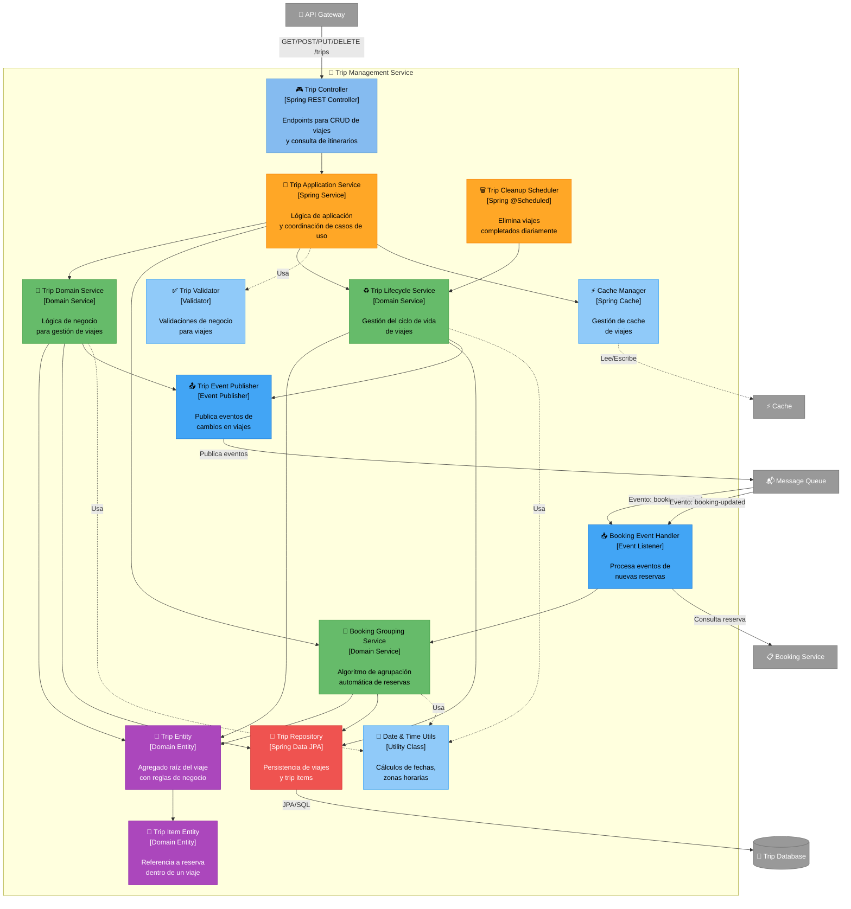

# C4 Nivel 3: Componentes - Trip Management Service

[⬅️ Volver al índice](./index-c4.md) | [⬆️ Nivel anterior: Contenedores](./c4-L2-contenedores.md)

---

## 📖 Descripción

El **Trip Management Service** es el núcleo del sistema Road Warrior, responsable de gestionar viajes, agrupar reservas automáticamente por viaje, y mantener el ciclo de vida de los viajes (desde la planificación hasta la eliminación automática después de completados).

### Alcance

- **Contenedor:** Trip Management Service
- **Tecnología:** Java / Spring Boot
- **Responsabilidad:** Gestión completa del ciclo de vida de los viajes y agrupación inteligente de reservas

---

## 🗺️ Diagrama de Componentes



---

## 🔍 Componentes Detallados

### Capa de Presentación (API)

| Componente | Responsabilidad | Endpoints |
|------------|-----------------|-----------|
| **Trip Controller** | - Expone API REST para viajes<br/>- Validación de requests<br/>- Transformación DTO ↔ Entity | - `GET /trips` - Listar viajes del usuario<br/>- `GET /trips/{id}` - Detalle de viaje<br/>- `POST /trips` - Crear viaje<br/>- `PUT /trips/{id}` - Actualizar viaje<br/>- `DELETE /trips/{id}` - Eliminar viaje<br/>- `GET /trips/upcoming` - Viajes próximos |

### Capa de Aplicación

| Componente | Responsabilidad | Métodos Clave |
|------------|-----------------|---------------|
| **Trip Application Service** | - Orquesta casos de uso<br/>- Coordina múltiples servicios de dominio<br/>- Maneja transacciones<br/>- Gestiona cache | - `createTrip()`<br/>- `updateTrip()`<br/>- `deleteTrip()`<br/>- `getTripDetails()`<br/>- `getUpcomingTrips()` |

### Capa de Dominio (Servicios)

| Componente | Responsabilidad | Lógica de Negocio |
|------------|-----------------|-------------------|
| **Trip Domain Service** | - CRUD de viajes<br/>- Validaciones de negocio<br/>- Reglas de consistencia | - Crear viaje con fechas válidas<br/>- Validar que fecha inicio < fecha fin<br/>- Asociar/desasociar trip items |
| **Booking Grouping Service** | - Algoritmo de agrupación automática<br/>- Detectar a qué viaje pertenece una reserva<br/>- Crear viaje si no existe | - **Estrategia de agrupación:**<br/>  1. Por fechas coincidentes<br/>  2. Por ubicación geográfica<br/>  3. Por proximidad temporal (±3 días)<br/>  4. Por metadata del usuario<br/>- Auto-crear viaje si no coincide con ninguno |
| **Trip Lifecycle Service** | - Gestión de estados del viaje<br/>- Eliminación de viajes completados<br/>- Archivado de viajes | - Estados: `PLANNED`, `IN_PROGRESS`, `COMPLETED`<br/>- Eliminar viajes `COMPLETED` después de 30 días<br/>- Transiciones de estado automáticas |

### Capa de Dominio (Entidades)

| Componente | Responsabilidad | Atributos Clave |
|------------|-----------------|-----------------|
| **Trip Entity** | - Agregado raíz del viaje<br/>- Encapsula reglas de negocio<br/>- Invariantes del dominio | - `id: UUID`<br/>- `userId: UUID`<br/>- `name: String`<br/>- `startDate: LocalDate`<br/>- `endDate: LocalDate`<br/>- `status: TripStatus`<br/>- `destination: String`<br/>- `items: List<TripItem>`<br/>- **Invariantes:**<br/>  • startDate ≤ endDate<br/>  • Al menos 1 item en viaje activo |
| **Trip Item Entity** | - Referencia a una reserva<br/>- Parte del agregado Trip | - `id: UUID`<br/>- `tripId: UUID`<br/>- `bookingId: UUID`<br/>- `bookingType: BookingType` (FLIGHT, HOTEL, CAR)<br/>- `sequence: Integer` (orden en itinerario) |

### Capa de Persistencia

| Componente | Responsabilidad | Tecnología |
|------------|-----------------|------------|
| **Trip Repository** | - Operaciones de persistencia<br/>- Queries personalizadas<br/>- Optimistic locking | Spring Data JPA<br/>Métodos:<br/>- `findByUserId()`<br/>- `findUpcomingTrips()`<br/>- `findByStatus()`<br/>- `findCompletedBefore(date)` |

### Capa de Eventos

| Componente | Responsabilidad | Eventos |
|------------|-----------------|---------|
| **Booking Event Handler** | - Escucha eventos de reservas<br/>- Dispara agrupación automática | - Consume: `booking-created`<br/>- Consume: `booking-updated`<br/>- Consume: `booking-deleted` |
| **Trip Event Publisher** | - Publica eventos de dominio<br/>- Notifica cambios en viajes | - Publica: `trip-created`<br/>- Publica: `trip-updated`<br/>- Publica: `trip-deleted`<br/>- Publica: `trip-item-added` |

### Tareas Programadas

| Componente | Responsabilidad | Frecuencia |
|------------|-----------------|------------|
| **Trip Cleanup Scheduler** | - Ejecuta limpieza de viajes antiguos<br/>- Elimina viajes completados hace >30 días | Diaria (02:00 AM UTC) |

### Componentes Utilitarios

| Componente | Responsabilidad | Funciones |
|------------|-----------------|-----------|
| **Date & Time Utils** | - Cálculos de fechas<br/>- Conversión de zonas horarias<br/>- Comparación de rangos | - `isDateInRange()`<br/>- `daysBetween()`<br/>- `toUserTimezone()`<br/>- `overlaps()` |
| **Trip Validator** | - Validaciones de reglas de negocio | - Valida fechas<br/>- Valida superposición de viajes<br/>- Valida items duplicados |
| **Cache Manager** | - Gestión de cache de viajes<br/>- Invalidación selectiva | - Cache de viajes por usuario<br/>- TTL: 15 minutos<br/>- Invalidación en updates |

---

## 🔄 Flujos de Datos

### 1. Crear Viaje Manualmente

```
Usuario → API Gateway → Trip Controller
                            ↓
                    Trip Application Service
                            ↓
                    Trip Validator (valida datos)
                            ↓
                    Trip Domain Service
                            ↓
                    Trip Entity (nuevo viaje)
                            ↓
                    Trip Repository → Trip DB
                            ↓
                    Trip Event Publisher → Message Queue (trip-created)
                            ↓
                    Cache Manager (invalida cache de usuario)
```

### 2. Agrupación Automática de Reserva Nueva

```
Integration Service → Message Queue (booking-created)
                            ↓
                    Booking Event Handler
                            ↓
                    Booking Service (obtiene detalles de reserva)
                            ↓
                    Booking Grouping Service
                            ↓
        ┌───────────────────┴───────────────────┐
        ↓                                       ↓
¿Existe viaje compatible?                 ¿No existe?
        ↓                                       ↓
  Trip Repository (buscar por fechas)    Trip Domain Service
        ↓                                   (crear viaje auto)
  Trip Entity (agregar trip item)              ↓
        ↓                                 Trip Repository
  Trip Repository (actualizar)                  ↓
        ↓                                 Trip Entity (nuevo)
  Trip Event Publisher                          ↓
  (trip-item-added)                       Trip Event Publisher
                                          (trip-created)
```

### 3. Consultar Viajes Próximos

```
Usuario → API Gateway → Trip Controller
                            ↓
                    Trip Application Service
                            ↓
                    Cache Manager (check cache)
                            ↓
                        ¿Hit? → Sí → Return
                            ↓
                          No
                            ↓
                    Trip Repository
                    (findUpcomingTrips)
                            ↓
                    Trip DB (WHERE endDate >= NOW() AND status != COMPLETED)
                            ↓
                    For each trip:
                      Booking Service (obtener detalles de cada reserva)
                            ↓
                    Cache Manager (guardar resultado)
                            ↓
                    Return viajes con reservas completas
```

### 4. Limpieza Automática de Viajes Completados

```
Scheduler (diario 02:00 AM) → Trip Cleanup Scheduler
                                    ↓
                            Trip Lifecycle Service
                                    ↓
                            Trip Repository
                            (findCompletedBefore(now - 30 days))
                                    ↓
                            For each completed trip:
                                    ↓
                            Trip Domain Service (delete)
                                    ↓
                            Trip Repository (soft delete / hard delete)
                                    ↓
                            Trip Event Publisher (trip-deleted)
                                    ↓
                            Cache Manager (invalidar cache)
```

### 5. Actualizar Estado de Viaje (IN_PROGRESS → COMPLETED)

```
Scheduler (diario) → Trip Lifecycle Service
                            ↓
                    Trip Repository (findAll con endDate < now)
                            ↓
                    For each trip:
                        Trip Entity (transición de estado)
                            ↓
                        PLANNED → IN_PROGRESS (si startDate <= now <= endDate)
                        IN_PROGRESS → COMPLETED (si endDate < now)
                            ↓
                        Trip Repository (update)
                            ↓
                        Trip Event Publisher (trip-updated)
```

---

## 🎯 Algoritmo de Agrupación Automática

El **Booking Grouping Service** usa un algoritmo multi-criterio para decidir a qué viaje pertenece una reserva:

### Paso 1: Búsqueda por Coincidencia Exacta de Fechas
```
Si reserva.fecha está entre trip.startDate y trip.endDate:
    → Agregar a ese viaje
```

### Paso 2: Búsqueda por Proximidad Temporal
```
Si reserva.fecha está dentro de ±3 días de algún trip:
    → Calcular puntuación de proximidad
    → Seleccionar viaje con mayor puntuación
```

### Paso 3: Búsqueda por Ubicación Geográfica
```
Si reserva.destination coincide con trip.destination:
    → Incrementar puntuación
```

### Paso 4: Decisión Final
```
Si puntuación_máxima > umbral (ej: 0.7):
    → Agregar reserva a ese viaje
Sino:
    → Crear nuevo viaje automáticamente
```

### Ejemplo de Scoring

```java
public double calculateTripMatchScore(Booking booking, Trip trip) {
    double score = 0.0;

    // Coincidencia de fechas (peso: 0.5)
    if (isDateInRange(booking.getDate(), trip.getStartDate(), trip.getEndDate())) {
        score += 0.5;
    } else {
        // Proximidad temporal (peso: 0.3)
        int daysGap = Math.abs(daysBetween(booking.getDate(), trip.getStartDate()));
        if (daysGap <= 3) {
            score += 0.3 * (1 - daysGap / 3.0);
        }
    }

    // Coincidencia de destino (peso: 0.3)
    if (booking.getDestination().equals(trip.getDestination())) {
        score += 0.3;
    }

    // Metadata adicional (peso: 0.2)
    if (booking.getTripHint() != null && booking.getTripHint().equals(trip.getName())) {
        score += 0.2;
    }

    return score;
}
```

---

## 📊 Modelo de Datos (Trip Database)

### Tabla: trips

| Campo | Tipo | Descripción |
|-------|------|-------------|
| id | UUID | PK |
| user_id | UUID | FK a usuarios |
| name | VARCHAR(200) | Nombre del viaje |
| destination | VARCHAR(200) | Destino principal |
| start_date | DATE | Fecha inicio |
| end_date | DATE | Fecha fin |
| status | VARCHAR(20) | PLANNED, IN_PROGRESS, COMPLETED |
| created_at | TIMESTAMP | Timestamp creación |
| updated_at | TIMESTAMP | Timestamp última actualización |
| deleted_at | TIMESTAMP | Soft delete (NULL si activo) |

### Tabla: trip_items

| Campo | Tipo | Descripción |
|-------|------|-------------|
| id | UUID | PK |
| trip_id | UUID | FK a trips |
| booking_id | UUID | FK a reservas (en Booking Service) |
| booking_type | VARCHAR(20) | FLIGHT, HOTEL, CAR |
| sequence | INTEGER | Orden en itinerario |
| created_at | TIMESTAMP | Timestamp creación |

### Índices

```sql
CREATE INDEX idx_trips_user_id ON trips(user_id);
CREATE INDEX idx_trips_status ON trips(status);
CREATE INDEX idx_trips_dates ON trips(start_date, end_date);
CREATE INDEX idx_trip_items_trip_id ON trip_items(trip_id);
CREATE INDEX idx_trip_items_booking_id ON trip_items(booking_id);
```

---

## 🎯 Patrones de Diseño Aplicados

### 1. Domain-Driven Design (DDD)
- **Aggregate Root:** Trip Entity
- **Entities:** Trip, TripItem
- **Domain Services:** TripDomainService, BookingGroupingService
- **Repository Pattern:** TripRepository

### 2. CQRS (Command Query Responsibility Segregation)
- **Commands:** CreateTrip, UpdateTrip, DeleteTrip
- **Queries:** GetTrip, GetUpcomingTrips (con cache optimizado)

### 3. Event-Driven Architecture
- **Domain Events:** trip-created, trip-updated, trip-deleted
- **Event Sourcing parcial:** Registro de cambios en viajes

### 4. Strategy Pattern
- **Uso:** Algoritmo de agrupación (puede tener múltiples estrategias)
- **Beneficio:** Permitir diferentes estrategias de agrupación según contexto

### 5. Scheduler Pattern
- **Uso:** Limpieza automática de viajes
- **Tecnología:** Spring @Scheduled

### 6. Cache-Aside Pattern
- **Uso:** Cache de viajes consultados frecuentemente
- **TTL:** 15 minutos

---

## 📊 Atributos de Calidad

### Usabilidad
- **Agrupación automática** reduce fricción para el usuario
- **Detección inteligente** de viajes relacionados
- **Auto-creación** de viajes cuando no existe coincidencia

### Performance
- **Cache** de viajes reduce latencia
- **Índices** optimizados para queries frecuentes
- **Queries paginadas** para listas grandes

### Mantenibilidad
- **DDD** con bounded context claro
- **Separación de capas** (API, Application, Domain, Repository)
- **Algoritmo de agrupación** aislado en servicio específico

### Escalabilidad
- **Stateless service** permite escalado horizontal
- **Event-driven** permite procesamiento asíncrono
- **Cache distribuido** (Redis) compartido entre instancias

### Confiabilidad
- **Soft delete** permite recuperación de viajes eliminados accidentalmente
- **Optimistic locking** previene conflictos de concurrencia
- **Transacciones** garantizan consistencia

---

## 🚀 Extensibilidad

### Agregar Nuevo Criterio de Agrupación

Modificar `BookingGroupingService.calculateTripMatchScore()`:

```java
// Nuevo criterio: coincidencia de número de confirmación
if (booking.getConfirmationPrefix().equals(trip.getConfirmationPrefix())) {
    score += 0.15;
}
```

### Agregar Nuevo Estado de Viaje

1. Actualizar enum `TripStatus`
2. Actualizar `TripLifecycleService` con nueva transición
3. Actualizar validaciones en `TripValidator`

---

## ⚙️ Configuración

```yaml
# application.yml
trip-management:
  grouping:
    enabled: true
    proximity-days: 3
    minimum-score-threshold: 0.7
  cleanup:
    enabled: true
    retention-days: 30
    schedule: "0 0 2 * * *"  # Diario a las 2 AM
  cache:
    ttl-minutes: 15
    max-size: 10000
```

---

## 📈 Métricas y Monitoreo

### Métricas Clave

- Número de viajes creados manualmente vs auto-creados
- Tasa de acierto de agrupación automática
- Número de reservas huérfanas (sin viaje asignado)
- Latencia de consultas de viajes
- Cache hit ratio
- Número de viajes eliminados por cleanup

### Alertas

- Tasa de auto-creación de viajes > 80% (indica mal algoritmo de agrupación)
- Cache hit ratio < 50%
- Latencia de queries > 500ms
- Cleanup fallando por > 2 días consecutivos

---

[⬅️ Volver al índice](./index-c4.md) | [⬆️ Nivel anterior: Contenedores](./c4-L2-contenedores.md)
