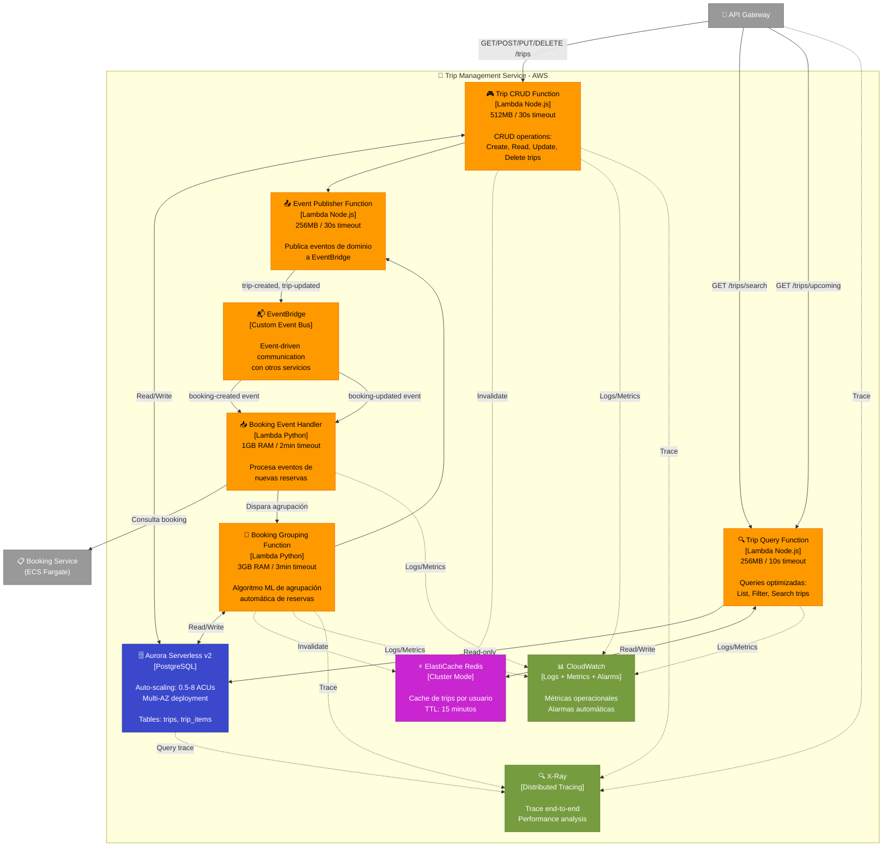

# C4 Nivel 3: Componentes - Trip Management Service (AWS)

[⬅️ Volver al índice](./index-c4.md) | [⬆️ Nivel anterior: Contenedores](./c4-L2-contenedores.md)

---

## 📖 Descripción

El **Trip Management Service** es el núcleo del sistema Road Warrior, responsable de gestionar viajes y agrupar reservas automáticamente. Implementado con **arquitectura serverless AWS** para máxima escalabilidad y eficiencia de costos.

### Alcance

- **Contenedor:** Trip Management Service
- **Arquitectura AWS:** Serverless con Aurora Serverless
- **Responsabilidad:** Gestión de viajes y agrupación inteligente de reservas

---

## 🗺️ Diagrama de Componentes (AWS)



---

## 🏗️ Arquitectura AWS: Decisiones y Justificaciones

### 🔶 Serverless First Approach

| Aspecto | Decisión | Justificación |
|---------|----------|---------------|
| **API Layer** | Lambda Functions | - Escalado automático instant <br/>- Pago por invocación<br/>- Sin gestión de servidores<br/>- Cold start < 200ms con optimización |
| **Database** | Aurora Serverless v2 | - Auto-scaling de capacidad (ACUs)<br/>- Pago por uso<br/>- Compatibilidad PostgreSQL<br/>- Pause automático en inactividad |
| **Events** | EventBridge | - Event-driven nativo<br/>- Routing de eventos<br/>- Integración con 300+ servicios |
| **Cache** | ElastiCache Redis | - Latencia sub-ms<br/>- Compartido entre Lambdas<br/>- Invalidación eficiente |

---

## 📋 Componentes AWS Detallados

### Lambda Functions

| Función Lambda | Justificación | Configuración |
|----------------|---------------|---------------|
| **Trip CRUD Function** | - **Operaciones simples** CRUD<br/>- **Stateless** y paralelizable<br/>- **Alta concurrencia** esperada<br/>- **Costo-efectivo** para APIs | - Runtime: Node.js 18<br/>- Memory: 512MB<br/>- Timeout: 30s<br/>- Reserved concurrency: 50<br/>- Provisioned: 5 (warm) |
| **Trip Query Function** | - **Read-only optimizado**<br/>- **Cache-aside pattern**<br/>- **Queries complejas** con joins<br/>- **Menor memoria** que CRUD | - Runtime: Node.js 18<br/>- Memory: 256MB<br/>- Timeout: 10s<br/>- Concurrency: 100<br/>- Provisioned: 10 |
| **Booking Grouping Function** | - **Algoritmo compute-intensive**<br/>- **ML scoring** de similitud<br/>- **3GB RAM** para dataset grande<br/>- **Python** para librerías ML | - Runtime: Python 3.11<br/>- Memory: 3GB<br/>- Timeout: 3 min<br/>- Ephemeral storage: 2GB<br/>- Layers: scikit-learn, pandas |
| **Booking Event Handler** | - **Event-driven** desde EventBridge<br/>- **Async processing**<br/>- **Coordina** con Grouping Function | - Runtime: Python 3.11<br/>- Memory: 1GB<br/>- Timeout: 2 min<br/>- Retry: 2 veces<br/>- DLQ: Sí |
| **Event Publisher Function** | - **Publica eventos** de dominio<br/>- **Batch publishing** a EventBridge<br/>- **Garantía de entrega** | - Runtime: Node.js 18<br/>- Memory: 256MB<br/>- Timeout: 30s<br/>- Batch: 10 eventos max |

**¿Por qué Lambda y no ECS para este servicio?**
- ✅ **Tráfico variable:** API requests varían mucho (picos en horarios de viaje)
- ✅ **Operaciones cortas:** Mayoría de operaciones < 30 segundos
- ✅ **Escalado instant:** De 0 a 1000 concurrent en segundos
- ✅ **Costo:** Solo paga cuando ejecuta, no 24/7
- ❌ **No hay procesos largos** como en Integration Service
- ❌ **No necesita estado** persistente

### Base de Datos

| Servicio AWS | Justificación | Configuración |
|--------------|---------------|---------------|
| **Aurora Serverless v2 (PostgreSQL)** | - **Auto-scaling** de 0.5 a 8 ACUs según carga<br/>- **Multi-AZ** automático para alta disponibilidad<br/>- **Backup continuo** a S3<br/>- **Compatibilidad** total con PostgreSQL<br/>- **Data API** para Lambdas sin VPC<br/>- **Pause automático** si no hay actividad (15 min) | - Engine: PostgreSQL 14<br/>- Min ACUs: 0.5 (1GB RAM)<br/>- Max ACUs: 8 (16GB RAM)<br/>- Multi-AZ: Sí<br/>- Backup retention: 7 días<br/>- Encryption: KMS<br/>- Data API: Habilitado |

**¿Por qué Aurora Serverless v2 y no RDS o DynamoDB?**

**vs RDS Standard:**
- ✅ **Auto-scaling:** RDS requiere dimensionamiento fijo
- ✅ **Costo:** Aurora Serverless paga por ACU-hora, no por instancia 24/7
- ✅ **Pause:** Aurora puede pausar automáticamente, RDS no

**vs DynamoDB:**
- ✅ **Queries complejas:** Necesitamos JOINs (trips + trip_items)
- ✅ **Transacciones ACID:** Agrupación requiere atomicidad
- ✅ **Familiaridad:** Equipo ya conoce PostgreSQL
- ❌ **Latencia:** DynamoDB es más rápido (single-digit ms)
- ❌ **Escalado:** DynamoDB escala mejor para >100K RPS

### Event-Driven Architecture

| Servicio AWS | Justificación | Configuración |
|--------------|---------------|---------------|
| **EventBridge** | - **Desacoplamiento** entre servicios<br/>- **Event routing** con reglas<br/>- **Schema registry** para validación<br/>- **Archive** de eventos para replay<br/>- **300+ destinos** nativos | - Event bus: Custom<br/>- Rules: 10 (filtering)<br/>- Archive: 30 días<br/>- Schema discovery: Sí<br/>- Dead-letter queue: Sí |

### Cache

| Servicio AWS | Justificación | Configuración |
|--------------|---------------|---------------|
| **ElastiCache Redis (Cluster Mode)** | - **Latencia <1ms** para queries frecuentes<br/>- **Cache compartido** entre Lambdas<br/>- **TTL automático** (15 min)<br/>- **Pub/Sub** para invalidación distribuida<br/>- **High availability** con Multi-AZ | - Node: cache.t4g.small<br/>- Nodes: 2 (Multi-AZ)<br/>- Engine: Redis 7.0<br/>- Encryption: In-transit<br/>- Backup: Diario |

**Cache Strategy:**
```
Key pattern: trip:{userId}:list
TTL: 15 minutos
Invalidation: On trip create/update/delete
```

### Monitoring y Observabilidad

| Servicio AWS | Justificación | Configuración |
|--------------|---------------|---------------|
| **CloudWatch Logs** | - **Centralizado** de todos los Lambdas<br/>- **Logs Insights** para queries<br/>- **Metric filters** para alarmas | - Retention: 30 días<br/>- Log groups: Por función<br/>- Insights queries: 5 saved |
| **CloudWatch Metrics** | - **Métricas custom** de negocio<br/>- **Dashboards** operacionales<br/>- **Anomaly detection** | - Custom namespace: TripService<br/>- Metrics: TripCreated, TripGrouped<br/>- Dashboards: 1 |
| **X-Ray** | - **Distributed tracing** end-to-end<br/>- **Service map** visual<br/>- **Latency analysis** | - Sampling: 10%<br/>- Annotations: userId, tripId<br/>- Groups: By error status |

---

## 🔄 Flujos de Datos con AWS

### 1. Crear Viaje Manual (API)

```
Usuario → API Gateway (POST /trips)
    ↓
Lambda Authorizer (valida JWT)
    ↓
Trip CRUD Function (Lambda)
    ↓
Aurora Serverless (INSERT en trips table)
    ↓ (Transaction committed)
Trip CRUD Function → Event Publisher Function
    ↓
EventBridge (trip-created event)
    ↓
ElastiCache (invalidate cache de usuario)
    ↓
CloudWatch (log + metric TripCreated)
    ↓
Return 201 Created + trip object
```

**Latencia típica:** 150-300ms
- API Gateway: 20ms
- Lambda cold start: 100ms (warm: 10ms)
- Aurora query: 20-50ms
- EventBridge async: No suma a latencia
- Cache invalidation: Async

### 2. Agrupación Automática de Reserva

```
Booking Service → EventBridge (booking-created event)
    ↓
EventBridge Rule (filter: type=booking-created)
    ↓
Booking Event Handler (Lambda)
    ↓
Paso 1: Query a Booking Service (obtener detalles)
    ↓ (HTTP call)
Booking Service retorna booking con fecha, destino
    ↓
Paso 2: Invoke Grouping Function (Lambda) con booking data
    ↓
Grouping Function:
    ├─ Query Aurora: SELECT trips WHERE userId=X AND dates overlap
    ├─ Algoritmo ML scoring (Python scikit-learn)
    ├─ Calcular score de similitud por trip candidato
    └─ Decidir:
        ├─ Score > 0.7? → Agregar a trip existente (UPDATE trip_items)
        └─ Score < 0.7? → Crear nuevo trip (INSERT trip + trip_item)
    ↓
Event Publisher → EventBridge (trip-item-added o trip-created)
    ↓
ElastiCache (invalidate cache)
```

**Por qué 3GB RAM para Grouping Function:**
- Algoritmo ML carga dataset de trips del usuario en memoria
- scikit-learn requiere RAM para matrices de features
- Para usuario con 100 trips = ~500MB de datos en memoria
- 3GB permite procesar usuarios power (200+ trips)

### 3. Consultar Viajes Próximos (Optimizado con Cache)

```
Usuario → API Gateway (GET /trips/upcoming)
    ↓
Trip Query Function (Lambda)
    ↓
ElastiCache Redis (GET trip:{userId}:upcoming)
    ↓
¿Cache HIT?
    ├─ Sí → Return desde cache (latencia total: 50ms)
    └─ No:
        ↓
        Aurora Serverless:
        SELECT t.*, array_agg(ti.*) as items
        FROM trips t
        LEFT JOIN trip_items ti ON t.id = ti.trip_id
        WHERE t.user_id = $1
          AND t.end_date >= NOW()
          AND t.status != 'COMPLETED'
        GROUP BY t.id
        ORDER BY t.start_date ASC
        LIMIT 20
        ↓ (50-100ms)
        For each trip:
            Query Booking Service para detalles de reservas
            (Parallel HTTP calls con Promise.all)
        ↓
        Combinar trips + booking details
        ↓
        ElastiCache (SET con TTL 15 min)
        ↓
        Return (latencia total: 300-500ms)
```

**Cache Hit Ratio esperado:** 70-80% (usuarios consultan frecuentemente)

### 4. Actualizar Viaje

```
Usuario → API Gateway (PUT /trips/{id})
    ↓
Trip CRUD Function (Lambda)
    ↓
Aurora Serverless (UPDATE trips WHERE id = $1)
    ↓
Event Publisher → EventBridge (trip-updated event)
    ↓
ElastiCache (invalidate cache del usuario)
    ↓
Return 200 OK + trip actualizado
```

---

## 💰 Análisis de Costos

### Costo Mensual Estimado (10,000 usuarios activos)

| Servicio | Uso | Costo Mensual |
|----------|-----|---------------|
| **Lambda - Trip CRUD** | 300,000 invocations × 200ms × 512MB | ~$8 |
| **Lambda - Trip Query** | 500,000 invocations × 100ms × 256MB | ~$6 |
| **Lambda - Grouping** | 50,000 invocations × 2s × 3GB | ~$35 |
| **Lambda - Event Handler** | 100,000 invocations × 500ms × 1GB | ~$10 |
| **Aurora Serverless v2** | Promedio 2 ACUs × 730 hrs | ~$130 |
| **ElastiCache Redis** | 2 nodes × cache.t4g.small × 730 hrs | ~$50 |
| **API Gateway** | 800,000 requests | ~$2.80 |
| **EventBridge** | 150,000 custom events | ~$1.50 |
| **CloudWatch Logs** | 30 GB ingested | ~$15 |
| **X-Ray** | 800,000 traces × 10% sampling | ~$4 |
| **Total** | | **~$262/mes** |

**Comparación con ECS Fargate 24/7:**
- ECS Fargate (1 vCPU, 2GB): ~$730/mes × 2 tasks = $1,460/mes
- **Ahorro con Serverless: 82%** 💰

**¿Por qué es más barato?**
- Lambda solo paga cuando ejecuta (no 24/7)
- Aurora Serverless escala a 0.5 ACUs en horas valle
- Cache reduce queries a base de datos

---

## 📊 Atributos de Calidad con AWS

### Escalabilidad

| Aspecto | Solución AWS | Capacidad |
|---------|--------------|-----------|
| **API Throughput** | Lambda concurrent: 1000 (default)<br/>API Gateway: 10,000 req/s | Soporta picos de tráfico masivos |
| **Database** | Aurora Serverless: Auto-scale a 8 ACUs<br/>Read replicas: Hasta 15 | Escala con carga |
| **Cache** | ElastiCache: Cluster mode con sharding | Millones de keys |

### Disponibilidad

| Aspecto | Solución AWS | SLA |
|---------|--------------|-----|
| **Lambda** | Multi-AZ automático | 99.95% |
| **Aurora** | Multi-AZ deployment | 99.99% |
| **ElastiCache** | Multi-AZ con failover | 99.99% |
| **EventBridge** | Regional service Multi-AZ | 99.99% |

### Performance

| Aspecto | Solución AWS | Latencia |
|---------|--------------|----------|
| **API Response** | Lambda + Cache | 50ms (cache hit)<br/>300ms (cache miss) |
| **Database Query** | Aurora + Provisioned IOPS | 20-50ms |
| **Cache Read** | ElastiCache Redis | <1ms |
| **Event Delivery** | EventBridge | <1s async |

### Costo-Eficiencia

| Aspecto | Solución | Ahorro |
|---------|----------|--------|
| **Lambda vs EC2** | Pago por invocación vs 24/7 | 70-80% |
| **Aurora Serverless vs RDS** | Auto-scaling + pause | 50-60% |
| **Cache layer** | ElastiCache reduce DB queries | 40% en Aurora costs |

---

## 🎯 Decisiones Arquitectónicas Clave

### ✅ Aurora Serverless v2 vs RDS vs DynamoDB

| Criterio | Aurora Serverless v2 ✅ | RDS Standard | DynamoDB |
|----------|------------------------|--------------|----------|
| **Auto-scaling** | ✅ 0.5-8 ACUs | ❌ Tamaño fijo | ✅ On-demand |
| **Queries complejas (JOINs)** | ✅ SQL completo | ✅ SQL completo | ❌ Limitado |
| **Transacciones ACID** | ✅ Nativo | ✅ Nativo | ⚠️ Limitadas |
| **Costo en baja carga** | ✅ Pause automático | ❌ 24/7 | ✅ Pay per request |
| **Latencia** | ⚠️ 20-50ms | ⚠️ 20-50ms | ✅ Single-digit ms |
| **Familiaridad** | ✅ PostgreSQL | ✅ PostgreSQL | ❌ NoSQL learning curve |

**Decisión:** Aurora Serverless v2 por balance costo-funcionalidad

### ✅ Lambda 3GB RAM para Grouping vs ECS

| Aspecto | Lambda 3GB ✅ | ECS Fargate |
|---------|--------------|-------------|
| **Costo por ejecución** | $0.0007 por invocación | $0.04 por minuto |
| **Escalado** | Instant (0 a 1000) | 30-60 segundos |
| **Cold start** | 500ms con provisioned | N/A |
| **Duración max** | 15 minutos | Sin límite |
| **Memoria max** | 10GB | 30GB |

**¿Por qué Lambda gana?**
- Agrupación toma <2 minutos (bien dentro de 15 min limit)
- 3GB RAM suficiente para dataset de usuario
- Invocaciones esporádicas (no necesita ECS 24/7)
- 95% más barato que ECS para este caso

### ✅ EventBridge como Event Bus

**EventBridge elegido porque:**
- ✅ **Event routing** con reglas (filter por tipo de evento)
- ✅ **Schema registry** para validación
- ✅ **Archive** de eventos (replay capability)
- ✅ **Múltiples destinos** desde 1 evento (fan-out)
- ✅ **Desacoplamiento** completo entre servicios

---

## 📈 Métricas Custom CloudWatch

```python
# Lambda Trip CRUD Function
import boto3
cloudwatch = boto3.client('cloudwatch')

# Al crear trip
cloudwatch.put_metric_data(
    Namespace='TripManagementService',
    MetricData=[
        {
            'MetricName': 'TripCreated',
            'Dimensions': [
                {'Name': 'CreationType', 'Value': 'Manual'}
            ],
            'Value': 1,
            'Unit': 'Count'
        }
    ]
)

# Al agrupar booking
cloudwatch.put_metric_data(
    Namespace='TripManagementService',
    MetricData=[
        {
            'MetricName': 'BookingGroupingScore',
            'Dimensions': [
                {'Name': 'Result', 'Value': 'Matched'}
            ],
            'Value': score,
            'Unit': 'None',
            'StorageResolution': 60  # High-resolution metric
        }
    ]
)
```

### Alarmas CloudWatch

| Alarma | Condición | Acción |
|--------|-----------|--------|
| **Lambda Errors > 5%** | ErrorRate > 5% por 5 min | SNS → PagerDuty |
| **Grouping Score Avg < 0.5** | AvgScore < 0.5 por 1 hora | SNS → Slack (review algoritmo) |
| **Aurora ACUs Max** | ACUs = 8 por 30 min | SNS → Escalar max ACUs |
| **ElastiCache Hit Rate < 60%** | CacheHitRate < 60% por 15 min | SNS → Review TTL |
| **API Latency p99 > 1s** | P99Latency > 1000ms por 10 min | SNS → On-call |

---

## 🎯 Algoritmo de Agrupación Automática

El **Booking Grouping Function** usa un algoritmo multi-criterio para decidir a qué viaje pertenece una reserva:

### Algoritmo de Scoring

```python
def calculate_trip_match_score(booking, trip):
    """
    Calcula score de 0.0 a 1.0 para determinar si booking pertenece a trip
    """
    score = 0.0

    # 1. Coincidencia de fechas (peso: 0.5)
    if is_date_in_range(booking.date, trip.start_date, trip.end_date):
        score += 0.5
    else:
        # Proximidad temporal (peso: 0.3)
        days_gap = abs(days_between(booking.date, trip.start_date))
        if days_gap <= 3:
            score += 0.3 * (1 - days_gap / 3.0)

    # 2. Coincidencia de destino (peso: 0.3)
    if booking.destination == trip.destination:
        score += 0.3

    # 3. Metadata adicional (peso: 0.2)
    if booking.trip_hint and booking.trip_hint == trip.name:
        score += 0.2

    return score

# Decisión de agrupación
if max_score > 0.7:
    # Alta confianza: agregar a trip existente
    add_booking_to_trip(booking, best_match_trip)
else:
    # Baja confianza: crear nuevo trip automático
    create_new_trip_from_booking(booking)
```

---

[⬅️ Volver al índice](./index-c4.md) | [⬆️ Nivel anterior: Contenedores](./c4-L2-contenedores.md)
