# C4 Nivel 3: Componentes - Booking Service

[⬅️ Volver al índice](./index-c4.md) | [⬆️ Nivel anterior: Contenedores](./c4-L2-contenedores.md)

---

## 📖 Descripción

El **Booking Service** gestiona todas las reservas individuales de vuelos, hoteles y autos. Es responsable del ciclo de vida completo de las reservas, desde el ingreso manual hasta la sincronización automática con proveedores externos.

### Alcance

- **Contenedor:** Booking Service
- **Tecnología:** Java / Spring Boot
- **Responsabilidad:** Gestión completa de reservas (CRUD, sincronización, búsqueda)

---

## 🗺️ Diagrama de Componentes

```mermaid
graph TB
    %% Componentes externos
    APIGateway["🚪 API Gateway"]
    IntegrationService["🔌 Integration Service"]
    MessageQueue["📬 Message Queue"]
    BookingDB[("📋 Booking Database")]
    Cache["⚡ Cache"]

    %% Componentes del Booking Service
    subgraph BookingService["📋 Booking Service"]

        %% API Controllers
        FlightController["✈️ Flight Controller<br/>[Spring REST Controller]<br/><br/>Endpoints para reservas<br/>de vuelos"]

        HotelController["🏨 Hotel Controller<br/>[Spring REST Controller]<br/><br/>Endpoints para reservas<br/>de hoteles"]

        CarController["🚗 Car Rental Controller<br/>[Spring REST Controller]<br/><br/>Endpoints para reservas<br/>de alquiler de autos"]

        BookingSearchController["🔍 Booking Search Controller<br/>[Spring REST Controller]<br/><br/>Búsqueda y filtrado<br/>de reservas"]

        %% Application Services
        BookingAppService["🎯 Booking Application Service<br/>[Spring Service]<br/><br/>Coordinación de casos de uso<br/>y orquestación"]

        SyncCoordinator["🔄 Sync Coordinator<br/>[Spring Service]<br/><br/>Coordina sincronización<br/>con proveedores externos"]

        %% Domain Services
        FlightBookingService["✈️ Flight Booking Service<br/>[Domain Service]<br/><br/>Lógica de negocio<br/>para vuelos"]

        HotelBookingService["🏨 Hotel Booking Service<br/>[Domain Service]<br/><br/>Lógica de negocio<br/>para hoteles"]

        CarBookingService["🚗 Car Booking Service<br/>[Domain Service]<br/><br/>Lógica de negocio<br/>para autos"]

        BookingSearchService["🔍 Booking Search Service<br/>[Domain Service]<br/><br/>Búsqueda avanzada<br/>y filtrado"]

        %% Domain Entities
        FlightBooking["✈️ Flight Booking<br/>[Domain Entity]<br/><br/>Entidad de reserva<br/>de vuelo"]

        HotelBooking["🏨 Hotel Booking<br/>[Domain Entity]<br/><br/>Entidad de reserva<br/>de hotel"]

        CarBooking["🚗 Car Booking<br/>[Domain Entity]<br/><br/>Entidad de reserva<br/>de auto"]

        %% Repositories
        FlightRepository["💾 Flight Repository<br/>[Spring Data JPA]<br/><br/>Persistencia de vuelos"]

        HotelRepository["💾 Hotel Repository<br/>[Spring Data JPA]<br/><br/>Persistencia de hoteles"]

        CarRepository["💾 Car Repository<br/>[Spring Data JPA]<br/><br/>Persistencia de autos"]

        %% Event Handlers
        SyncEventHandler["📥 Sync Event Handler<br/>[Event Listener]<br/><br/>Procesa eventos de<br/>sincronización"]

        %% Event Publishers
        BookingEventPublisher["📤 Booking Event Publisher<br/>[Event Publisher]<br/><br/>Publica eventos de<br/>cambios en reservas"]

        %% Utilities
        BookingValidator["✅ Booking Validator<br/>[Validator]<br/><br/>Validaciones de<br/>reglas de negocio"]

        BookingMapper["🔄 Booking Mapper<br/>[Mapper]<br/><br/>Transforma DTOs<br/>y entidades"]

        CacheManager["⚡ Cache Manager<br/>[Spring Cache]<br/><br/>Gestión de cache<br/>de reservas"]

        DuplicateDetector["🔎 Duplicate Detector<br/>[Utility]<br/><br/>Detecta reservas<br/>duplicadas"]
    end

    %% Relaciones externas - API
    APIGateway -->|REST API| FlightController
    APIGateway -->|REST API| HotelController
    APIGateway -->|REST API| CarController
    APIGateway -->|REST API| BookingSearchController

    %% Controllers a Application Service
    FlightController --> BookingAppService
    HotelController --> BookingAppService
    CarController --> BookingAppService
    BookingSearchController --> BookingSearchService

    %% Application Service a Domain Services
    BookingAppService --> FlightBookingService
    BookingAppService --> HotelBookingService
    BookingAppService --> CarBookingService

    %% Sync Coordination
    BookingAppService --> SyncCoordinator
    SyncCoordinator -->|POST /sync| IntegrationService

    %% Domain Services a Entities
    FlightBookingService --> FlightBooking
    HotelBookingService --> HotelBooking
    CarBookingService --> CarBooking

    %% Domain Services a Repositories
    FlightBookingService --> FlightRepository
    HotelBookingService --> HotelRepository
    CarBookingService --> CarRepository

    BookingSearchService --> FlightRepository
    BookingSearchService --> HotelRepository
    BookingSearchService --> CarRepository

    %% Repositories a Database
    FlightRepository -->|JPA/SQL| BookingDB
    HotelRepository -->|JPA/SQL| BookingDB
    CarRepository -->|JPA/SQL| BookingDB

    %% Event Handling
    MessageQueue -->|booking-synced| SyncEventHandler
    SyncEventHandler --> DuplicateDetector
    SyncEventHandler --> FlightBookingService
    SyncEventHandler --> HotelBookingService
    SyncEventHandler --> CarBookingService

    %% Event Publishing
    FlightBookingService --> BookingEventPublisher
    HotelBookingService --> BookingEventPublisher
    CarBookingService --> BookingEventPublisher
    BookingEventPublisher -->|Publica eventos| MessageQueue

    %% Utilities
    BookingAppService -.->|Usa| BookingValidator
    BookingAppService -.->|Usa| BookingMapper

    FlightBookingService -.->|Usa| BookingValidator
    HotelBookingService -.->|Usa| BookingValidator
    CarBookingService -.->|Usa| BookingValidator

    %% Cache
    BookingSearchService --> CacheManager
    CacheManager -.->|Lee/Escribe| Cache

    %% Estilos
    classDef controller fill:#85bbf0,stroke:#5d9dd5,color:#000000
    classDef appservice fill:#ffa726,stroke:#f57c00,color:#000000
    classDef domainservice fill:#66bb6a,stroke:#43a047,color:#000000
    classDef entity fill:#ab47bc,stroke:#8e24aa,color:#ffffff
    classDef repository fill:#ef5350,stroke:#d32f2f,color:#ffffff
    classDef event fill:#42a5f5,stroke:#1976d2,color:#000000
    classDef utility fill:#90caf9,stroke:#42a5f5,color:#000000
    classDef external fill:#999999,stroke:#6b6b6b,color:#ffffff

    class FlightController,HotelController,CarController,BookingSearchController controller
    class BookingAppService,SyncCoordinator appservice
    class FlightBookingService,HotelBookingService,CarBookingService,BookingSearchService domainservice
    class FlightBooking,HotelBooking,CarBooking entity
    class FlightRepository,HotelRepository,CarRepository repository
    class SyncEventHandler,BookingEventPublisher event
    class BookingValidator,BookingMapper,CacheManager,DuplicateDetector utility
    class APIGateway,IntegrationService,MessageQueue,BookingDB,Cache external
```



---

## 🔍 Componentes Detallados

### Capa de Presentación (API Controllers)

| Componente | Responsabilidad | Endpoints Clave |
|------------|-----------------|-----------------|
| **Flight Controller** | - CRUD de reservas de vuelos<br/>- Validación de requests | - `POST /bookings/flights` - Crear reserva<br/>- `GET /bookings/flights/{id}` - Consultar<br/>- `PUT /bookings/flights/{id}` - Actualizar<br/>- `DELETE /bookings/flights/{id}` - Eliminar |
| **Hotel Controller** | - CRUD de reservas de hoteles<br/>- Validación de requests | - `POST /bookings/hotels` - Crear reserva<br/>- `GET /bookings/hotels/{id}` - Consultar<br/>- `PUT /bookings/hotels/{id}` - Actualizar<br/>- `DELETE /bookings/hotels/{id}` - Eliminar |
| **Car Rental Controller** | - CRUD de reservas de autos<br/>- Validación de requests | - `POST /bookings/cars` - Crear reserva<br/>- `GET /bookings/cars/{id}` - Consultar<br/>- `PUT /bookings/cars/{id}` - Actualizar<br/>- `DELETE /bookings/cars/{id}` - Eliminar |
| **Booking Search Controller** | - Búsqueda de todas las reservas<br/>- Filtrado y paginación | - `GET /bookings` - Listar todas<br/>- `GET /bookings/search?query=...` - Buscar<br/>- `GET /bookings/by-date-range` - Por fechas<br/>- `GET /bookings/by-destination` - Por destino |

### Capa de Aplicación

| Componente | Responsabilidad | Métodos Clave |
|------------|-----------------|---------------|
| **Booking Application Service** | - Orquesta casos de uso<br/>- Coordina múltiples domain services<br/>- Maneja transacciones<br/>- Conversión DTO ↔ Entity | - `createBooking()`<br/>- `updateBooking()`<br/>- `deleteBooking()`<br/>- `getBookingDetails()` |
| **Sync Coordinator** | - Coordina sincronización con proveedores<br/>- Dispara sync por usuario o global<br/>- Maneja scheduling de syncs | - `syncUserBookings(userId)`<br/>- `syncAllUsers()`<br/>- `schedulePeriodicSync()` |

### Capa de Dominio (Servicios)

| Componente | Responsabilidad | Lógica de Negocio |
|------------|-----------------|-------------------|
| **Flight Booking Service** | - Gestión de reservas de vuelos<br/>- Validaciones específicas de vuelos | - Validar fechas de vuelo<br/>- Validar número de pasajeros<br/>- Calcular duración de vuelo<br/>- Detectar conexiones vs directos |
| **Hotel Booking Service** | - Gestión de reservas de hoteles<br/>- Validaciones específicas de hoteles | - Validar fechas check-in/check-out<br/>- Validar número de huéspedes<br/>- Calcular número de noches |
| **Car Booking Service** | - Gestión de reservas de autos<br/>- Validaciones específicas de autos | - Validar fechas pickup/drop-off<br/>- Validar edad del conductor<br/>- Calcular días de renta |
| **Booking Search Service** | - Búsqueda avanzada<br/>- Filtrado multi-criterio<br/>- Ordenamiento | - Buscar por rango de fechas<br/>- Buscar por destino<br/>- Buscar por proveedor<br/>- Ordenar por fecha, precio, tipo |

### Capa de Dominio (Entidades)

| Componente | Atributos Clave | Invariantes |
|------------|-----------------|-------------|
| **Flight Booking** | - `id: UUID`<br/>- `userId: UUID`<br/>- `confirmationNumber: String`<br/>- `airline: String`<br/>- `flightNumber: String`<br/>- `origin: String`<br/>- `destination: String`<br/>- `departureDate: LocalDateTime`<br/>- `arrivalDate: LocalDateTime`<br/>- `passengers: List<Passenger>`<br/>- `source: BookingSource` (MANUAL, SYNCED) | - departureDate < arrivalDate<br/>- Al menos 1 pasajero<br/>- confirmationNumber único |
| **Hotel Booking** | - `id: UUID`<br/>- `userId: UUID`<br/>- `confirmationNumber: String`<br/>- `hotelChain: String`<br/>- `hotelName: String`<br/>- `location: String`<br/>- `checkInDate: LocalDate`<br/>- `checkOutDate: LocalDate`<br/>- `guests: Integer`<br/>- `roomType: String`<br/>- `source: BookingSource` | - checkInDate < checkOutDate<br/>- guests > 0<br/>- confirmationNumber único |
| **Car Booking** | - `id: UUID`<br/>- `userId: UUID`<br/>- `confirmationNumber: String`<br/>- `rentalCompany: String`<br/>- `pickupLocation: String`<br/>- `dropoffLocation: String`<br/>- `pickupDate: LocalDateTime`<br/>- `dropoffDate: LocalDateTime`<br/>- `vehicleType: String`<br/>- `driverAge: Integer`<br/>- `source: BookingSource` | - pickupDate < dropoffDate<br/>- driverAge >= 21 (mínimo)<br/>- confirmationNumber único |

### Capa de Persistencia

| Componente | Responsabilidad | Queries Personalizadas |
|------------|-----------------|------------------------|
| **Flight Repository** | - Persistencia de vuelos<br/>- Queries optimizadas | - `findByUserId()`<br/>- `findByDateRange()`<br/>- `findByDestination()`<br/>- `findByConfirmationNumber()`<br/>- `findDuplicates()` |
| **Hotel Repository** | - Persistencia de hoteles<br/>- Queries optimizadas | - `findByUserId()`<br/>- `findByDateRange()`<br/>- `findByLocation()`<br/>- `findByConfirmationNumber()`<br/>- `findDuplicates()` |
| **Car Repository** | - Persistencia de autos<br/>- Queries optimizadas | - `findByUserId()`<br/>- `findByDateRange()`<br/>- `findByLocation()`<br/>- `findByConfirmationNumber()`<br/>- `findDuplicates()` |

### Capa de Eventos

| Componente | Responsabilidad | Eventos |
|------------|-----------------|---------|
| **Sync Event Handler** | - Escucha eventos de sincronización<br/>- Procesa reservas sincronizadas<br/>- Detecta duplicados | - Consume: `booking-synced` (del Integration Service)<br/>- Valida y persiste reservas |
| **Booking Event Publisher** | - Publica eventos de cambios<br/>- Notifica a otros servicios | - Publica: `booking-created`<br/>- Publica: `booking-updated`<br/>- Publica: `booking-deleted` |

### Componentes Utilitarios

| Componente | Responsabilidad | Funciones |
|------------|-----------------|-----------|
| **Booking Validator** | - Validaciones de reglas de negocio<br/>- Validaciones por tipo | - `validateFlightBooking()`<br/>- `validateHotelBooking()`<br/>- `validateCarBooking()`<br/>- `validateDates()` |
| **Booking Mapper** | - Conversión DTO ↔ Entity<br/>- Mapeo de datos externos | - `toEntity(dto)`<br/>- `toDTO(entity)`<br/>- `fromExternalFormat()` |
| **Cache Manager** | - Cache de búsquedas frecuentes<br/>- Invalidación selectiva | - Cache de búsquedas por usuario<br/>- TTL: 10 minutos<br/>- Invalidación en updates |
| **Duplicate Detector** | - Detecta reservas duplicadas<br/>- Fuzzy matching | - Compara por confirmationNumber<br/>- Compara por fechas + destino<br/>- Previene duplicados en sync |

---

## 🔄 Flujos de Datos

### 1. Ingreso Manual de Reserva (Flight)

```
Usuario → API Gateway → Flight Controller
                            ↓
                    Booking Application Service
                            ↓
                    Booking Validator (validar datos)
                            ↓
                    Booking Mapper (DTO → Entity)
                            ↓
                    Flight Booking Service
                            ↓
                    Flight Booking (nuevo)
                            ↓
                    Flight Repository → Booking DB
                            ↓
                    Booking Event Publisher → Message Queue (booking-created)
                            ↓
                    Trip Management Service (escucha evento y agrupa)
```

### 2. Sincronización Automática de Reservas

```
Sync Coordinator (scheduler) → Integration Service (POST /sync)
                                        ↓
                                Integration Service consulta APIs externas
                                        ↓
                                Message Queue (booking-synced con datos)
                                        ↓
                                Sync Event Handler
                                        ↓
                                Duplicate Detector
                                    ↓         ↓
                        ¿Es duplicado?    ¿No existe?
                                ↓             ↓
                          Ignorar        Booking Mapper
                                             ↓
                                     Flight/Hotel/Car Booking Service
                                             ↓
                                     Repository → Booking DB
                                             ↓
                                     Booking Event Publisher (booking-created)
```

### 3. Búsqueda de Reservas por Usuario

```
Usuario → API Gateway → Booking Search Controller
                                ↓
                        Booking Search Service
                                ↓
                        Cache Manager (check cache)
                                ↓
                            ¿Hit? → Sí → Return
                                ↓
                              No
                                ↓
                        Flight Repository + Hotel Repository + Car Repository
                                ↓
                        Booking DB (queries paralelas)
                                ↓
                        Combinar y ordenar resultados
                                ↓
                        Cache Manager (guardar con TTL 10 min)
                                ↓
                        Return lista consolidada
```

### 4. Actualizar Reserva

```
Usuario → API Gateway → Flight Controller (PUT /bookings/flights/{id})
                                ↓
                        Booking Application Service
                                ↓
                        Flight Booking Service (obtener existente)
                                ↓
                        Booking Validator (validar cambios)
                                ↓
                        Flight Booking (actualizar entidad)
                                ↓
                        Flight Repository (update)
                                ↓
                        Booking Event Publisher (booking-updated)
                                ↓
                        Cache Manager (invalidar cache de usuario)
```

### 5. Detección de Duplicados

```
Sync Event Handler recibe reserva sincronizada
        ↓
Duplicate Detector
        ↓
Query en DB por:
  - confirmationNumber exacto
  - userId + fechas + destino similares
        ↓
¿Match encontrado?
    ↓           ↓
  Sí         No
    ↓           ↓
Comparar       Crear
detalles       nueva
    ↓         reserva
¿Son iguales?
    ↓       ↓
  Sí      No
    ↓       ↓
Ignorar  Actualizar
        existente
```

---

## 📊 Modelo de Datos (Booking Database)

### Tabla: flight_bookings

| Campo | Tipo | Descripción |
|-------|------|-------------|
| id | UUID | PK |
| user_id | UUID | FK a usuarios |
| confirmation_number | VARCHAR(50) | Número de confirmación |
| airline | VARCHAR(100) | Aerolínea |
| flight_number | VARCHAR(20) | Número de vuelo |
| origin | VARCHAR(100) | Aeropuerto origen (código IATA) |
| destination | VARCHAR(100) | Aeropuerto destino (código IATA) |
| departure_date | TIMESTAMP | Fecha/hora salida |
| arrival_date | TIMESTAMP | Fecha/hora llegada |
| passengers | JSONB | Lista de pasajeros |
| seat_numbers | VARCHAR(200) | Números de asiento |
| booking_class | VARCHAR(20) | Clase (Economy, Business, First) |
| source | VARCHAR(20) | MANUAL o SYNCED |
| external_id | VARCHAR(100) | ID en sistema externo (si synced) |
| created_at | TIMESTAMP | Timestamp creación |
| updated_at | TIMESTAMP | Timestamp actualización |

### Tabla: hotel_bookings

| Campo | Tipo | Descripción |
|-------|------|-------------|
| id | UUID | PK |
| user_id | UUID | FK a usuarios |
| confirmation_number | VARCHAR(50) | Número de confirmación |
| hotel_chain | VARCHAR(100) | Cadena hotelera |
| hotel_name | VARCHAR(200) | Nombre del hotel |
| location | VARCHAR(200) | Ubicación |
| check_in_date | DATE | Fecha check-in |
| check_out_date | DATE | Fecha check-out |
| guests | INTEGER | Número de huéspedes |
| room_type | VARCHAR(100) | Tipo de habitación |
| room_number | VARCHAR(20) | Número de habitación (si asignado) |
| source | VARCHAR(20) | MANUAL o SYNCED |
| external_id | VARCHAR(100) | ID en sistema externo |
| created_at | TIMESTAMP | Timestamp creación |
| updated_at | TIMESTAMP | Timestamp actualización |

### Tabla: car_bookings

| Campo | Tipo | Descripción |
|-------|------|-------------|
| id | UUID | PK |
| user_id | UUID | FK a usuarios |
| confirmation_number | VARCHAR(50) | Número de confirmación |
| rental_company | VARCHAR(100) | Empresa de renta |
| pickup_location | VARCHAR(200) | Ubicación recogida |
| dropoff_location | VARCHAR(200) | Ubicación devolución |
| pickup_date | TIMESTAMP | Fecha/hora recogida |
| dropoff_date | TIMESTAMP | Fecha/hora devolución |
| vehicle_type | VARCHAR(100) | Tipo de vehículo |
| vehicle_make_model | VARCHAR(200) | Marca/modelo |
| driver_age | INTEGER | Edad del conductor |
| source | VARCHAR(20) | MANUAL o SYNCED |
| external_id | VARCHAR(100) | ID en sistema externo |
| created_at | TIMESTAMP | Timestamp creación |
| updated_at | TIMESTAMP | Timestamp actualización |

### Índices

```sql
-- Flight Bookings
CREATE INDEX idx_flight_user_id ON flight_bookings(user_id);
CREATE INDEX idx_flight_confirmation ON flight_bookings(confirmation_number);
CREATE INDEX idx_flight_dates ON flight_bookings(departure_date, arrival_date);
CREATE INDEX idx_flight_destination ON flight_bookings(destination);

-- Hotel Bookings
CREATE INDEX idx_hotel_user_id ON hotel_bookings(user_id);
CREATE INDEX idx_hotel_confirmation ON hotel_bookings(confirmation_number);
CREATE INDEX idx_hotel_dates ON hotel_bookings(check_in_date, check_out_date);
CREATE INDEX idx_hotel_location ON hotel_bookings(location);

-- Car Bookings
CREATE INDEX idx_car_user_id ON car_bookings(user_id);
CREATE INDEX idx_car_confirmation ON car_bookings(confirmation_number);
CREATE INDEX idx_car_dates ON car_bookings(pickup_date, dropoff_date);
CREATE INDEX idx_car_location ON car_bookings(pickup_location);

-- Duplicate detection
CREATE INDEX idx_flight_duplicate ON flight_bookings(user_id, departure_date, destination);
CREATE INDEX idx_hotel_duplicate ON hotel_bookings(user_id, check_in_date, location);
CREATE INDEX idx_car_duplicate ON car_bookings(user_id, pickup_date, pickup_location);
```

---

## 🎯 Patrones de Diseño Aplicados

### 1. Strategy Pattern
- **Uso:** Domain Services específicos por tipo (Flight, Hotel, Car)
- **Beneficio:** Lógica de negocio específica por tipo de reserva

### 2. Repository Pattern
- **Uso:** FlightRepository, HotelRepository, CarRepository
- **Beneficio:** Abstracción de persistencia

### 3. Event-Driven Architecture
- **Uso:** Publicación de eventos de cambios en reservas
- **Beneficio:** Desacoplamiento con Trip Management Service

### 4. Cache-Aside Pattern
- **Uso:** Cache de búsquedas frecuentes
- **Beneficio:** Reducir latencia en consultas

### 5. Anti-Corruption Layer
- **Uso:** Booking Mapper transforma datos externos
- **Beneficio:** Protege modelo de dominio de formatos externos

### 6. Duplicate Detection Pattern
- **Uso:** Duplicate Detector con fuzzy matching
- **Beneficio:** Previene reservas duplicadas de sincronización

---

## 📊 Atributos de Calidad

### Interoperabilidad
- **Booking Mapper** transforma múltiples formatos externos a modelo unificado
- **Sync Coordinator** coordina con Integration Service

### Disponibilidad
- **Cache** permite consultas rápidas sin DB
- **Event-driven** permite procesamiento asíncrono de syncs

### Escalabilidad
- **Stateless service** permite escalado horizontal
- **Queries optimizadas** con índices adecuados
- **Cache distribuido** compartido entre instancias

### Integridad de Datos
- **Duplicate Detector** previene duplicados
- **Validaciones** en múltiples capas
- **Transacciones** garantizan consistencia

### Usabilidad
- **Ingreso manual** para reservas no sincronizadas
- **Búsqueda avanzada** con múltiples filtros
- **Consolidación** de múltiples tipos en una vista

---

## 🚀 Extensibilidad

### Agregar Nuevo Tipo de Reserva (ej: Trains)

1. Crear `TrainBooking` entity
2. Crear `TrainBookingService` domain service
3. Crear `TrainController` REST controller
4. Crear `TrainRepository`
5. Actualizar `BookingSearchService`
6. Agregar tabla `train_bookings` en DB

**Sin cambios en:** Integration Service, Trip Management Service

---

## ⚙️ Configuración

```yaml
# application.yml
booking-service:
  sync:
    enabled: true
    schedule: "0 0 4 * * *"  # Diario a las 4 AM
    batch-size: 100
  duplicate-detection:
    enabled: true
    fuzzy-match-threshold: 0.8
  cache:
    ttl-minutes: 10
    max-size: 50000
  validation:
    min-driver-age: 21
    max-passengers-per-booking: 9
```

---

## 📈 Métricas y Monitoreo

### Métricas Clave

- Número de reservas por tipo (Flight, Hotel, Car)
- Ratio manual vs synced
- Tasa de duplicados detectados
- Latencia de búsquedas
- Cache hit ratio
- Errores de validación

### Alertas

- Tasa de duplicados > 10%
- Latencia de búsqueda > 300ms
- Cache hit ratio < 60%
- Errores de sync > 5% de requests

---

[⬅️ Volver al índice](./index-c4.md) | [⬆️ Nivel anterior: Contenedores](./c4-L2-contenedores.md)
