# C4 Nivel 3: Componentes - User Service

[⬅️ Volver al índice](./index-c4.md) | [⬆️ Nivel anterior: Contenedores](./c4-L2-contenedores.md)

---

## 📖 Descripción

El **User Service** es responsable de la gestión completa de usuarios, autenticación, autorización y gestión de credenciales de programas de viajero frecuente (aerolíneas, hoteles, autos). Es el guardián de la seguridad del sistema.

### Alcance

- **Contenedor:** User Service
- **Tecnología:** Node.js / Express
- **Responsabilidad:** Autenticación, autorización, gestión de usuarios y credenciales de proveedores

---

## 🗺️ Diagrama de Componentes

```mermaid
graph TB
    %% Componentes externos
    APIGateway["🚪 API Gateway"]
    UserDB[("👤 User Database")]
    Cache["⚡ Cache"]
    MessageQueue["📬 Message Queue"]

    %% Componentes del User Service
    subgraph UserService["👥 User Service"]

        %% API Controllers
        AuthController["🔐 Auth Controller<br/>[Express Router]<br/><br/>Endpoints de autenticación<br/>y registro"]

        UserController["👤 User Controller<br/>[Express Router]<br/><br/>Endpoints de gestión<br/>de usuarios"]

        ProfileController["📝 Profile Controller<br/>[Express Router]<br/><br/>Endpoints de perfiles<br/>de viajero"]

        LoyaltyController["🎖️ Loyalty Program Controller<br/>[Express Router]<br/><br/>Endpoints para credenciales<br/>de programas de viajero"]

        %% Application Services
        AuthService["🎯 Authentication Service<br/>[Service Class]<br/><br/>Lógica de autenticación<br/>y gestión de tokens"]

        UserManagementService["🎯 User Management Service<br/>[Service Class]<br/><br/>Lógica de gestión<br/>de usuarios"]

        %% Domain Services
        PasswordService["🔒 Password Service<br/>[Domain Service]<br/><br/>Hashing y validación<br/>de contraseñas"]

        TokenService["🎫 Token Service<br/>[Domain Service]<br/><br/>Generación y validación<br/>de JWT tokens"]

        ProfileService["📝 Profile Service<br/>[Domain Service]<br/><br/>Gestión de perfiles<br/>de viajero"]

        LoyaltyProgramService["🎖️ Loyalty Program Service<br/>[Domain Service]<br/><br/>Gestión de credenciales<br/>de programas de fidelización"]

        %% Security Components
        CredentialEncryptor["🔐 Credential Encryptor<br/>[Security Component]<br/><br/>Encriptación de credenciales<br/>sensibles (AES-256)"]

        JWTManager["🎫 JWT Manager<br/>[Security Component]<br/><br/>Creación y verificación<br/>de JWT tokens"]

        PasswordHasher["🔒 Password Hasher<br/>[Security Component]<br/><br/>Bcrypt hashing<br/>de contraseñas"]

        %% Repositories
        UserRepository["💾 User Repository<br/>[Data Access]<br/><br/>Persistencia de usuarios"]

        ProfileRepository["💾 Profile Repository<br/>[Data Access]<br/><br/>Persistencia de perfiles"]

        LoyaltyRepository["💾 Loyalty Repository<br/>[Data Access]<br/><br/>Persistencia de credenciales<br/>de programas"]

        %% Validators
        UserValidator["✅ User Validator<br/>[Validator]<br/><br/>Validación de datos<br/>de usuario"]

        EmailValidator["✉️ Email Validator<br/>[Validator]<br/><br/>Validación de emails<br/>y verificación"]

        %% Event Publishers
        UserEventPublisher["📤 User Event Publisher<br/>[Event Publisher]<br/><br/>Publica eventos de<br/>cambios en usuarios"]

        %% Cache Manager
        SessionCacheManager["⚡ Session Cache Manager<br/>[Cache Manager]<br/><br/>Gestión de sesiones<br/>en cache"]

        %% Utilities
        EmailService["📧 Email Service<br/>[External Service]<br/><br/>Envío de emails de<br/>verificación y recuperación"]
    end

    %% Relaciones externas
    APIGateway -->|POST /auth/login| AuthController
    APIGateway -->|POST /auth/register| AuthController
    APIGateway -->|POST /auth/logout| AuthController
    APIGateway -->|GET/PUT /users/me| UserController
    APIGateway -->|GET/PUT /users/profile| ProfileController
    APIGateway -->|POST/PUT /users/loyalty-programs| LoyaltyController

    %% Controllers a Services
    AuthController --> AuthService
    UserController --> UserManagementService
    ProfileController --> ProfileService
    LoyaltyController --> LoyaltyProgramService

    %% Application Services a Domain Services
    AuthService --> PasswordService
    AuthService --> TokenService
    UserManagementService --> ProfileService

    %% Domain Services
    PasswordService --> PasswordHasher
    TokenService --> JWTManager
    LoyaltyProgramService --> CredentialEncryptor

    %% Services a Repositories
    AuthService --> UserRepository
    UserManagementService --> UserRepository
    ProfileService --> ProfileRepository
    LoyaltyProgramService --> LoyaltyRepository

    %% Repositories a Database
    UserRepository -->|SQL| UserDB
    ProfileRepository -->|SQL| UserDB
    LoyaltyRepository -->|SQL| UserDB

    %% Validation
    AuthService -.->|Usa| UserValidator
    AuthService -.->|Usa| EmailValidator
    UserManagementService -.->|Usa| UserValidator
    UserManagementService -.->|Usa| EmailValidator

    %% Cache
    AuthService --> SessionCacheManager
    SessionCacheManager -.->|Lee/Escribe| Cache

    %% Events
    AuthService --> UserEventPublisher
    UserManagementService --> UserEventPublisher
    UserEventPublisher -->|Publica eventos| MessageQueue

    %% Email
    AuthService -.->|Envía emails| EmailService

    %% Estilos
    classDef controller fill:#85bbf0,stroke:#5d9dd5,color:#000000
    classDef appservice fill:#ffa726,stroke:#f57c00,color:#000000
    classDef domainservice fill:#66bb6a,stroke:#43a047,color:#000000
    classDef security fill:#e91e63,stroke:#c2185b,color:#ffffff
    classDef repository fill:#ef5350,stroke:#d32f2f,color:#ffffff
    classDef validator fill:#90caf9,stroke:#42a5f5,color:#000000
    classDef event fill:#42a5f5,stroke:#1976d2,color:#000000
    classDef utility fill:#78909c,stroke:#546e7a,color:#ffffff
    classDef external fill:#999999,stroke:#6b6b6b,color:#ffffff

    class AuthController,UserController,ProfileController,LoyaltyController controller
    class AuthService,UserManagementService appservice
    class PasswordService,TokenService,ProfileService,LoyaltyProgramService domainservice
    class CredentialEncryptor,JWTManager,PasswordHasher security
    class UserRepository,ProfileRepository,LoyaltyRepository repository
    class UserValidator,EmailValidator validator
    class UserEventPublisher event
    class SessionCacheManager utility
    class EmailService external
    class APIGateway,UserDB,Cache,MessageQueue external
```



---

## 🔍 Componentes Detallados

### Capa de Presentación (API Controllers)

| Componente | Responsabilidad | Endpoints Clave |
|------------|-----------------|-----------------|
| **Auth Controller** | - Autenticación de usuarios<br/>- Registro de nuevos usuarios<br/>- Logout y refresh tokens | - `POST /auth/register` - Registro<br/>- `POST /auth/login` - Login<br/>- `POST /auth/logout` - Logout<br/>- `POST /auth/refresh` - Refresh token<br/>- `POST /auth/forgot-password` - Recuperar contraseña<br/>- `POST /auth/reset-password` - Resetear contraseña |
| **User Controller** | - Gestión de datos del usuario<br/>- Actualización de información | - `GET /users/me` - Obtener usuario actual<br/>- `PUT /users/me` - Actualizar usuario<br/>- `DELETE /users/me` - Eliminar cuenta<br/>- `PUT /users/me/password` - Cambiar contraseña |
| **Profile Controller** | - Gestión de perfil de viajero<br/>- Preferencias de viaje | - `GET /users/profile` - Obtener perfil<br/>- `PUT /users/profile` - Actualizar perfil<br/>- `PUT /users/profile/preferences` - Preferencias |
| **Loyalty Program Controller** | - Gestión de credenciales<br/>- Programas de fidelización | - `GET /users/loyalty-programs` - Listar programas<br/>- `POST /users/loyalty-programs` - Agregar credenciales<br/>- `PUT /users/loyalty-programs/{id}` - Actualizar<br/>- `DELETE /users/loyalty-programs/{id}` - Eliminar |

### Capa de Aplicación

| Componente | Responsabilidad | Métodos Clave |
|------------|-----------------|---------------|
| **Authentication Service** | - Orquesta proceso de autenticación<br/>- Gestión de sesiones<br/>- Recuperación de contraseña | - `register(email, password)`<br/>- `login(email, password)`<br/>- `logout(userId)`<br/>- `refreshToken(refreshToken)`<br/>- `forgotPassword(email)`<br/>- `resetPassword(token, newPassword)` |
| **User Management Service** | - CRUD de usuarios<br/>- Actualización de información<br/>- Eliminación de cuentas | - `getUserById(id)`<br/>- `updateUser(id, data)`<br/>- `deleteUser(id)`<br/>- `changePassword(id, oldPwd, newPwd)` |

### Capa de Dominio (Servicios)

| Componente | Responsabilidad | Lógica de Negocio |
|------------|-----------------|-------------------|
| **Password Service** | - Validación de fuerza de contraseña<br/>- Hashing de contraseñas<br/>- Comparación de contraseñas | - **Requisitos de contraseña:**<br/>  • Mínimo 8 caracteres<br/>  • Al menos 1 mayúscula<br/>  • Al menos 1 minúscula<br/>  • Al menos 1 número<br/>  • Al menos 1 carácter especial<br/>- Hash con bcrypt (cost factor: 12) |
| **Token Service** | - Generación de JWT tokens<br/>- Validación de tokens<br/>- Refresh de tokens | - **Access Token:** TTL 15 minutos<br/>- **Refresh Token:** TTL 7 días<br/>- **Reset Password Token:** TTL 1 hora<br/>- Almacenar refresh tokens en DB |
| **Profile Service** | - Gestión de perfiles de viajero<br/>- Preferencias de viaje | - Nombre completo<br/>- Fecha de nacimiento<br/>- Pasaporte / ID<br/>- Preferencias de asiento<br/>- Preferencias de comida<br/>- Contactos de emergencia |
| **Loyalty Program Service** | - Gestión de credenciales de programas<br/>- Encriptación de datos sensibles<br/>- Validación de credenciales | - Aerolíneas: número de viajero frecuente<br/>- Hoteles: número de programa de puntos<br/>- Autos: número de programa de recompensas<br/>- Credenciales encriptadas en DB |

### Componentes de Seguridad

| Componente | Responsabilidad | Tecnología |
|------------|-----------------|------------|
| **Credential Encryptor** | - Encriptación/desencriptación de credenciales<br/>- Gestión de claves de encriptación | - Algoritmo: AES-256-GCM<br/>- Key rotation cada 90 días<br/>- IV aleatorio por credencial |
| **JWT Manager** | - Creación de tokens JWT<br/>- Verificación de firmas<br/>- Validación de claims | - Algoritmo: RS256 (RSA)<br/>- Claims: userId, email, roles<br/>- Issuer: Road Warrior |
| **Password Hasher** | - Hashing de contraseñas<br/>- Verificación de hashes | - Algoritmo: bcrypt<br/>- Cost factor: 12<br/>- Salt automático |

### Capa de Persistencia

| Componente | Responsabilidad | Queries |
|------------|-----------------|---------|
| **User Repository** | - Persistencia de usuarios<br/>- Queries de autenticación | - `findByEmail()`<br/>- `findById()`<br/>- `create()`<br/>- `update()`<br/>- `delete()` (soft delete) |
| **Profile Repository** | - Persistencia de perfiles | - `findByUserId()`<br/>- `update()`<br/>- `create()` |
| **Loyalty Repository** | - Persistencia de credenciales de programas | - `findByUserId()`<br/>- `findByProgramType()`<br/>- `create()`<br/>- `update()`<br/>- `delete()` |

### Validadores

| Componente | Responsabilidad | Validaciones |
|------------|-----------------|--------------|
| **User Validator** | - Validar datos de usuario<br/>- Reglas de negocio | - Email único<br/>- Edad mínima: 18 años<br/>- Campos obligatorios completos |
| **Email Validator** | - Validar formato de email<br/>- Verificación de email | - Formato RFC 5322<br/>- Envío de email de verificación<br/>- Confirmación requerida para login |

### Componentes de Eventos

| Componente | Responsabilidad | Eventos |
|------------|-----------------|---------|
| **User Event Publisher** | - Publicar eventos de dominio | - Publica: `user-registered`<br/>- Publica: `user-updated`<br/>- Publica: `user-deleted`<br/>- Publica: `loyalty-credentials-added` |

### Infraestructura

| Componente | Responsabilidad | Tecnología |
|------------|-----------------|------------|
| **Session Cache Manager** | - Almacenar sesiones activas<br/>- Invalidar sesiones<br/>- Blacklist de tokens | - Redis con TTL automático<br/>- Prefijo: `session:{userId}`<br/>- Invalidación en logout |

---

## 🔄 Flujos de Datos

### 1. Registro de Usuario

```
Usuario → API Gateway → Auth Controller (POST /auth/register)
                            ↓
                    Authentication Service
                            ↓
                    User Validator (validar email único, datos)
                            ↓
                    Email Validator (validar formato)
                            ↓
                    Password Service
                            ↓
                    Password Hasher (hash de contraseña)
                            ↓
                    User Repository → User DB (crear usuario)
                            ↓
                    Profile Repository → User DB (crear perfil vacío)
                            ↓
                    Email Service (enviar email de verificación)
                            ↓
                    User Event Publisher → Message Queue (user-registered)
                            ↓
                    Return success (email de verificación enviado)
```

### 2. Login de Usuario

```
Usuario → API Gateway → Auth Controller (POST /auth/login)
                            ↓
                    Authentication Service
                            ↓
                    User Repository (findByEmail)
                            ↓
                    ¿Usuario existe?
                        ↓           ↓
                      Sí          No → Error 401
                        ↓
                    ¿Email verificado?
                        ↓           ↓
                      Sí          No → Error 403 (verificar email)
                        ↓
                    Password Service
                            ↓
                    Password Hasher (comparar hash)
                            ↓
                    ¿Contraseña correcta?
                        ↓           ↓
                      Sí          No → Error 401
                        ↓
                    Token Service
                        ↓           ↓
              Access Token    Refresh Token
                        ↓
                    Session Cache Manager (guardar sesión en Redis)
                        ↓
                    Return tokens
```

### 3. Verificación de Token (en API Gateway)

```
Request → API Gateway
            ↓
      ¿Token presente en header?
            ↓
          Sí
            ↓
      JWT Manager (verificar firma)
            ↓
      ¿Firma válida?
        ↓       ↓
      Sí      No → Error 401
        ↓
      ¿Token expirado?
        ↓       ↓
      No      Sí → Error 401 (usar refresh token)
        ↓
      Session Cache Manager (verificar sesión activa)
        ↓       ↓
     Activa   Revocada → Error 401
        ↓
      Extraer userId de token
        ↓
      Forward request a servicio con userId en header
```

### 4. Agregar Credenciales de Programa de Viajero Frecuente

```
Usuario → API Gateway → Loyalty Controller (POST /loyalty-programs)
                            ↓
                    Loyalty Program Service
                            ↓
                    Credential Encryptor (encriptar credenciales)
                            ↓
                    Loyalty Repository → User DB (guardar encriptadas)
                            ↓
                    User Event Publisher → Message Queue
                    (loyalty-credentials-added)
                            ↓
                    Integration Service (escucha evento)
                            ↓
                    Dispara sincronización inicial con proveedor
```

### 5. Refresh Token

```
Cliente → API Gateway → Auth Controller (POST /auth/refresh)
                            ↓
                    Token Service
                            ↓
                    JWT Manager (verificar refresh token)
                            ↓
                    User Repository (obtener usuario)
                            ↓
                    ¿Refresh token válido y no expirado?
                        ↓               ↓
                      Sí              No → Error 401
                        ↓
                    JWT Manager (generar nuevo access token)
                            ↓
                    Session Cache Manager (actualizar sesión)
                            ↓
                    Return nuevo access token
```

### 6. Logout

```
Usuario → API Gateway → Auth Controller (POST /auth/logout)
                            ↓
                    Authentication Service
                            ↓
                    Session Cache Manager
                        ↓
                    Invalidar sesión en Redis (borrar key)
                        ↓
                    Agregar access token a blacklist (hasta expiración)
                        ↓
                    Return success
```

### 7. Recuperar Contraseña

```
Usuario → API Gateway → Auth Controller (POST /auth/forgot-password)
                            ↓
                    Authentication Service
                            ↓
                    User Repository (findByEmail)
                            ↓
                    ¿Usuario existe? → No → Return success (por seguridad)
                        ↓
                      Sí
                        ↓
                    Token Service (generar reset token)
                        ↓
                    User Repository (guardar token hash + expiración)
                        ↓
                    Email Service (enviar email con link de reset)
                        ↓
                    Return success
```

---

## 📊 Modelo de Datos (User Database)

### Tabla: users

| Campo | Tipo | Descripción |
|-------|------|-------------|
| id | UUID | PK |
| email | VARCHAR(255) | Email único (índice) |
| password_hash | VARCHAR(255) | Bcrypt hash |
| email_verified | BOOLEAN | Email verificado |
| email_verification_token | VARCHAR(255) | Token de verificación |
| reset_password_token_hash | VARCHAR(255) | Hash de token de reset |
| reset_password_expires | TIMESTAMP | Expiración de reset token |
| created_at | TIMESTAMP | Timestamp creación |
| updated_at | TIMESTAMP | Timestamp actualización |
| deleted_at | TIMESTAMP | Soft delete |
| last_login | TIMESTAMP | Último login |

### Tabla: user_profiles

| Campo | Tipo | Descripción |
|-------|------|-------------|
| id | UUID | PK |
| user_id | UUID | FK a users (unique) |
| first_name | VARCHAR(100) | Nombre |
| last_name | VARCHAR(100) | Apellido |
| date_of_birth | DATE | Fecha de nacimiento |
| passport_number | VARCHAR(50) | Número de pasaporte (encriptado) |
| phone_number | VARCHAR(20) | Teléfono |
| preferred_language | VARCHAR(10) | Idioma (ej: es, en) |
| preferred_currency | VARCHAR(3) | Moneda (ej: USD, EUR) |
| timezone | VARCHAR(50) | Zona horaria |
| seat_preference | VARCHAR(50) | Preferencia asiento (Window, Aisle) |
| meal_preference | VARCHAR(50) | Preferencia comida |
| emergency_contact | JSONB | Contacto de emergencia |
| created_at | TIMESTAMP | Timestamp creación |
| updated_at | TIMESTAMP | Timestamp actualización |

### Tabla: loyalty_programs

| Campo | Tipo | Descripción |
|-------|------|-------------|
| id | UUID | PK |
| user_id | UUID | FK a users |
| program_type | VARCHAR(50) | AIRLINE, HOTEL, CAR_RENTAL |
| provider_name | VARCHAR(100) | Nombre del proveedor |
| membership_number | VARCHAR(255) | Número de membresía (encriptado) |
| username | VARCHAR(255) | Usuario (encriptado) |
| password_encrypted | TEXT | Contraseña (encriptada AES-256) |
| encryption_iv | VARCHAR(255) | IV para desencriptación |
| created_at | TIMESTAMP | Timestamp creación |
| updated_at | TIMESTAMP | Timestamp actualización |

### Tabla: refresh_tokens

| Campo | Tipo | Descripción |
|-------|------|-------------|
| id | UUID | PK |
| user_id | UUID | FK a users |
| token_hash | VARCHAR(255) | Hash del refresh token |
| expires_at | TIMESTAMP | Expiración |
| created_at | TIMESTAMP | Timestamp creación |
| revoked | BOOLEAN | Token revocado |

### Índices

```sql
CREATE UNIQUE INDEX idx_users_email ON users(email);
CREATE INDEX idx_users_deleted_at ON users(deleted_at);
CREATE INDEX idx_user_profiles_user_id ON user_profiles(user_id);
CREATE INDEX idx_loyalty_user_id ON loyalty_programs(user_id);
CREATE INDEX idx_loyalty_type ON loyalty_programs(program_type);
CREATE INDEX idx_refresh_tokens_user_id ON refresh_tokens(user_id);
CREATE INDEX idx_refresh_tokens_expires ON refresh_tokens(expires_at);
```

---

## 🎯 Patrones de Diseño Aplicados

### 1. Repository Pattern
- **Uso:** UserRepository, ProfileRepository, LoyaltyRepository
- **Beneficio:** Abstracción de persistencia

### 2. Service Layer Pattern
- **Uso:** Authentication Service, User Management Service
- **Beneficio:** Separación de lógica de negocio de controllers

### 3. Strategy Pattern (Encryption)
- **Uso:** CredentialEncryptor con múltiples algoritmos
- **Beneficio:** Permitir cambio de algoritmo de encriptación

### 4. Token Bucket (Session Management)
- **Uso:** Session Cache Manager con TTL
- **Beneficio:** Expiración automática de sesiones

### 5. Event-Driven Architecture
- **Uso:** User Event Publisher
- **Beneficio:** Notificar a otros servicios de cambios

### 6. Cache-Aside Pattern
- **Uso:** Session Cache Manager
- **Beneficio:** Performance en validación de sesiones

---

## 🔒 Seguridad

### Autenticación

- **JWT con RS256:** Firma asimétrica, clave privada solo en User Service
- **Access Token:** TTL corto (15 min) para limitar ventana de exposición
- **Refresh Token:** TTL largo (7 días) con rotación en cada uso
- **Token Blacklist:** Tokens revocados en Redis hasta expiración

### Almacenamiento de Contraseñas

- **Bcrypt:** Algoritmo resistente a ataques de fuerza bruta
- **Cost Factor 12:** Balance entre seguridad y performance
- **Salt automático:** Protección contra rainbow tables

### Encriptación de Credenciales

- **AES-256-GCM:** Encriptación autenticada
- **IV aleatorio:** Diferente para cada credencial
- **Key Rotation:** Claves de encriptación rotan cada 90 días
- **Key Management:** Claves almacenadas en AWS KMS / HashiCorp Vault

### Protección contra Ataques

| Ataque | Mitigación |
|--------|------------|
| **Brute Force** | Rate limiting en API Gateway (5 intentos/minuto) |
| **Rainbow Tables** | Bcrypt con salt automático |
| **JWT Tampering** | Verificación de firma RS256 |
| **Session Hijacking** | HTTPS obligatorio, secure cookies |
| **XSS** | HttpOnly cookies, CSP headers |
| **SQL Injection** | Prepared statements en todos los queries |
| **Credential Stuffing** | Detección de patrones anómalos, CAPTCHA |

---

## 📊 Atributos de Calidad

### Seguridad
- **Encriptación** de credenciales sensibles
- **Hashing** robusto de contraseñas
- **JWT** con firma asimétrica
- **Soft delete** permite auditoría

### Disponibilidad
- **Session cache** en Redis distribuido
- **Stateless JWT** permite escalado horizontal
- **Refresh tokens** permiten reconexión sin reautenticación

### Performance
- **Cache de sesiones** reduce hits a DB
- **JWT** evita consultas a DB en cada request
- **Índices** optimizados para queries frecuentes

### Compliance
- **GDPR:** Derecho al olvido (soft delete), exportación de datos
- **PCI DSS:** No almacenamos datos de tarjetas
- **Encriptación** de datos sensibles en reposo

---

## 📈 Métricas y Monitoreo

### Métricas Clave

- Número de registros por día
- Tasa de login exitoso vs fallido
- Latencia de autenticación
- Número de refresh tokens activos
- Tasa de verificación de email
- Número de credenciales de programas almacenadas

### Alertas

- Tasa de login fallido > 20%
- Latencia de autenticación > 200ms
- Intentos de login desde IP sospechosas
- Key rotation fallando

---

[⬅️ Volver al índice](./index-c4.md) | [⬆️ Nivel anterior: Contenedores](./c4-L2-contenedores.md)
